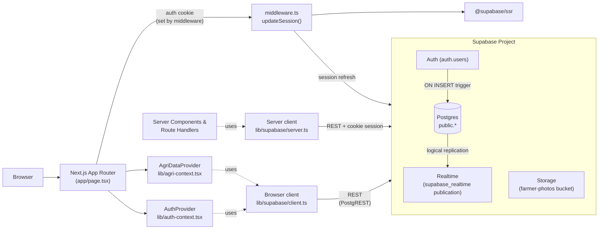
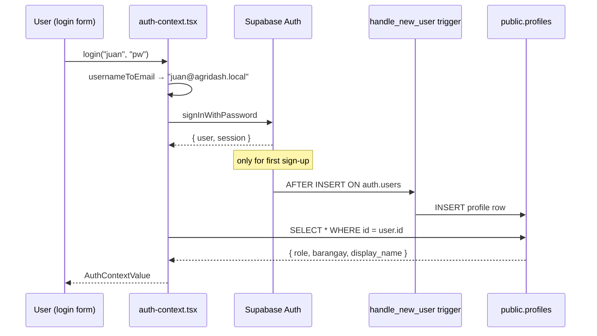
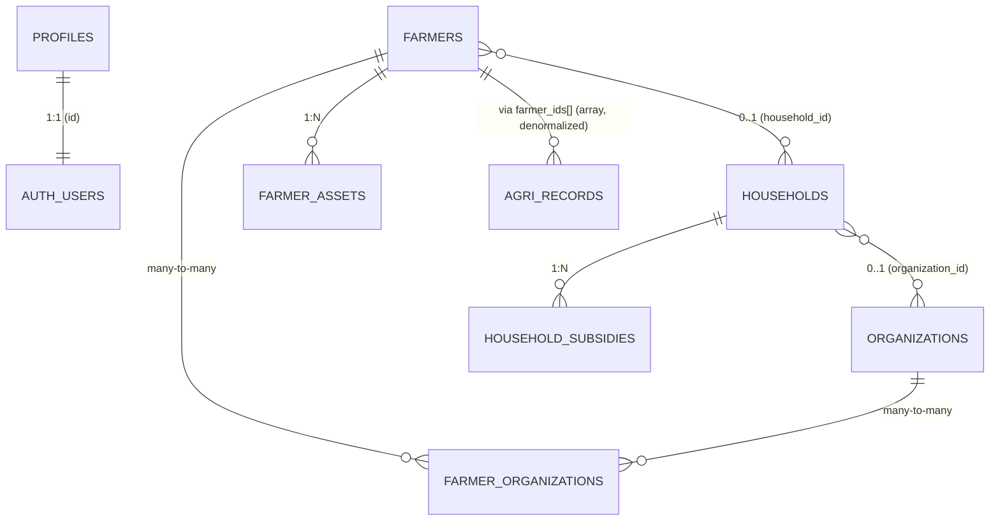

# Database Architecture

How AgriDash connects to and uses Supabase. This document describes the actual wiring as of the Phase 4 refactor — not aspirations.

## 1. Runtime topology



The client never talks to a custom backend. Every read/write goes directly from React → `@supabase/ssr` → PostgREST, gated by Row-Level Security policies. There is no edge function and no server action proxying database access today.

## 2. Supabase services in use

| Service | How it's used | Where |
|---|---|---|
| **Auth** | Email+password sign-in via `auth.users`. Username is mapped to a synthetic email `<username>@agridash.local`. | `lib/auth-context.tsx` |
| **Postgres (public schema)** | Primary data store. All app data lives in `public.*` tables. | `lib/agri-context.tsx` |
| **Row-Level Security** | Per-row visibility tied to the caller's role + barangay. SQL helper functions read the JWT claims. | every migration touching `public.*` |
| **Realtime publication** | All seven data tables are added to the `supabase_realtime` publication. | migrations 001, 002, 007 + `scripts/full-setup.sql` |
| **Storage** | Single public bucket `farmer-photos` for `photo_url` on `public.farmers`. | `migrations/STORAGE.md` |

**Realtime client subscription status** — *not active*. A grep across the repo for `supabase.channel(` and `postgres_changes` returns zero hits. The publication is configured at the database level so a future subscriber would receive events, but no React component subscribes today; the data layer is initial-fetch + manual refetch on mutation.

## 3. Connection layers (`lib/supabase/*`)

Four files, each with a single responsibility:

### `env.ts`
Reads `NEXT_PUBLIC_SUPABASE_URL` and the publishable/anon key from `process.env`. Used by every other file in the folder. Falls back to `""` and logs a missing-env warning rather than throwing, so dev still boots with a clearer error than a network failure.

### `client.ts`
Browser-side client built with `createBrowserClient` from `@supabase/ssr`. Singleton — instantiated once and reused. Exported two ways:

```ts
getSupabaseBrowserClient()  // explicit accessor
supabase                    // lazy Proxy for legacy `import { supabase }` callers
```

Throws if accessed during SSR (`typeof window === "undefined"`), preventing accidental server-side use.

### `server.ts`
Used in Server Components and Route Handlers. Builds a `createServerClient` bound to the **current request's cookie jar** via Next's `cookies()`. This is how the session that the middleware refreshed becomes visible to server-rendered code.

### `middleware.ts` → `updateSession(request)`
Runs on every navigation (wired in `middleware.ts` at the repo root). Constructs a one-shot server client bound to the request/response cookies, calls `supabase.auth.getUser()` to refresh the JWT, and writes any rotated cookies back into the response. Without this step, sessions would silently expire on the next page load.

## 4. Auth flow



- **Synthetic emails**: usernames are converted to `<username>@agridash.local`. Users never type an email. (`lib/auth-context.tsx`, `usernameToEmail()`)
- **Profiles**: `public.profiles` mirrors `auth.users` with role + barangay. The mirror is maintained by the `handle_new_user` trigger installed in `migrations/006_auto_profile_trigger.sql`. The first auth user is auto-promoted to `SUPER_ADMIN`.
- **Roles**: `SUPER_ADMIN` | `ADMIN` | `BARANGAY_USER`. Used both for UI scoping (`isBarangayUser`, `isAdmin`, etc.) and for RLS policy decisions.
- **JWT → RLS**: the JWT's `sub` is the `auth.uid()`. Two SQL helpers — `public.get_user_role()` and `public.get_user_barangay()` — read the role/barangay from the matching profile row inside policy expressions.

## 5. Row-Level Security

RLS is enabled on every data table. The policy shape is consistent:

```sql
USING (
  public.get_user_role() IN ('SUPER_ADMIN', 'ADMIN')
  OR barangay = public.get_user_barangay()
)
```

| Table | Visibility | Mutation |
|---|---|---|
| `organizations` | Public to all authenticated users for SELECT | Admin-or-above only (Phase tightened in `004_organizations_admin_only.sql`) |
| `households` | Own barangay, or admin-or-above | Same |
| `farmer_organizations` | Inherits the farmer's barangay scope | Same |
| `household_subsidies` | Inherits the household's barangay scope | Same |
| `farmer_assets` | Inherits the farmer's barangay scope | Same |
| `agri_records` | Own barangay, or admin-or-above (migration `016`) | Same; `WITH CHECK` on INSERT/UPDATE prevents writing rows tagged with another barangay |
| `profiles` | Self-row visible; admin-or-above sees all | Self + admin-or-above |

## 6. Database schema

Seven tables in `public.*`, plus `auth.users` from Supabase Auth.



### Core tables

| Table | Purpose | Phase introduced |
|---|---|---|
| `profiles` | Mirror of `auth.users` with role + barangay | Phase 0 (`006_auto_profile_trigger.sql`) |
| `organizations` | Co-ops / associations / household groups | Phase 0 (`001`) |
| `households` | Family unit with planting capacity (`farming_area_hectares`) | Phase 0 (`001`) |
| `farmers` | Individual farmer/fisherfolk profile, FK to household | Phase 0 (pre-existing), columns added in `001` |
| `farmer_organizations` | Many-to-many join | Phase 0 (`001`) |
| `household_subsidies` | Per-household subsidy line items (fertilizer, seeds, cash, etc.) | Phase 0 (`002`) |
| `farmer_assets` | Per-farmer asset inventory (machinery, fishpond, livestock, planting area) | Phase 0 (`007`, `009` added livestock category) |
| `agri_records` | The core production-cycle record. One row per (farmer set × period × commodity × variety). | Phase 0 (pre-existing, heavily extended in Phases 1–2) |

### `agri_records` column evolution

| Column | Type | Added in | Notes |
|---|---|---|---|
| `id`, `barangay`, `commodity`, `sub_category` | text | original | |
| `farmer_ids` | text[] | original | denormalized; resolved via `farmers` lookup in client |
| `farmer_male`, `farmer_female`, `total_farmers`, `farmer_names` | mixed | original | denormalized counts written by the client |
| `planting_area_hectares`, `harvesting_output_bags`, `damage_pests_hectares`, `damage_calamity_hectares` | numeric | original | crop fields |
| `stocking`, `harvesting_fishery` | numeric | original | fishery (pieces) |
| `pests_diseases`, `calamity`, `remarks` | text | original | |
| `calamity_sub_category` | text | `003` | controlled values: Typhoon/Flood/… |
| `period_month`, `period_year` | int | original | reporting period |
| `lifecycle_status` | text | `010` | legacy: `planted` / `damaged` / `harvested` / `total_loss` |
| `commodity_group` | text | `011` (Phase 1) | `CROP` / `FISHERY` / `LIVESTOCK` — denormalized for filters + RLS-friendly queries |
| `status` | text | `011` (Phase 1) | new canonical: `active` / `harvested` / `damaged` / `archived` |
| `fishery_loss_pieces` | numeric | `011` (Phase 1) | |
| `livestock_stocking_heads`, `livestock_output_heads`, `livestock_dead_heads` | numeric | `011` (Phase 1) | |

Constraints (all `NOT VALID` initially, validated by `012` and `014` after backfill):

| Constraint | Phase | Enforces |
|---|---|---|
| `commodity_group_valid` | 1 | enum check |
| `status_valid` | 1 | enum check |
| `fishery_loss_sane`, `livestock_*_sane` | 1 | 0–1,000,000 bounds |
| `fishery_units_valid`, `livestock_units_valid` | 1 | fishery/livestock cannot use hectare or bag fields |
| `crop_damage_leq_area` | 2 | for crop rows, damage ≤ planted area |
| `status_harvest_requires_output` | 2 | `harvested` rows must have output > 0 in the correct unit |
| `status_damage_requires_loss` | 2 | `damaged` rows must have loss > 0 and zero finalized output |

Triggers:

- `agri_records_archived_terminal_trg` (Phase 2, `015`) — `BEFORE UPDATE OF status`. Raises an exception if `OLD.status = 'archived' AND NEW.status <> 'archived'`. Makes archived status terminal.
- `handle_new_user` (Phase 0, `006`) — auto-creates a `profiles` row on `auth.users` insert.

## 7. How a typical operation flows

### Read on dashboard mount

```
1. <AuthProvider> mounts → reads supabase.auth.getUser() from cookie
2. <AgriDataProvider> mounts → SELECT * FROM each table (records, farmers, households, organizations, farmer_organizations, household_subsidies, farmer_assets)
3. Provider derives "visible" slices (vr, vf, vh, vo) by filtering on userBarangay when role = BARANGAY_USER
4. Provider computes Phase 4 aggregations (lifecycleSummary, capacitySummary, damageSummary, etc.) via lib/domain/metrics.ts
5. Children consume via useAgriData()
```

### Write a new record

```
1. RecordFormDialog → recordFormSchema (zod) validates
2. addRecord(payload) in agri-context.tsx:
   a. computeFarmerFields() — denormalizes farmer_male / farmer_female / total_farmers from the registry
   b. validateHouseholdCropAllocation() — enforces household capacity ceiling (lib/domain/allocation.ts)
   c. agriRecordInsertRow() — maps form payload to DB column shape (includes derived lifecycle_status + new status)
   d. supabase.from("agri_records").insert(...) — server runs CHECK constraints
3. On success: setRecords(prev => [...prev, newRecord]) — optimistic local update
   On error: friendlyDbError() translates Postgres error codes (23514 = CHECK violation) into user-readable messages
```

### Status transition (e.g. active → archived)

```
1. RecordFormDialog status dropdown gates options via canTransition(savedStatus, candidate)
2. On submit, deriveLifecycleFromStatus(status, damageTotal, prevLifecycle) computes the legacy lifecycle_status for back-compat
3. UPDATE agri_records SET status = $new, lifecycle_status = $derived ...
4. If new.status was changing OUT of 'archived', the BEFORE UPDATE trigger (migration 015) raises an exception that surfaces to the form as an error message
```

## 8. Migration timeline

| # | File | Phase | What it adds |
|---|---|---|---|
| 001 | `001_households_orgs.sql` | 0 | households, organizations, farmer_organizations, profiles columns, RLS |
| 002 | `002_household_subsidies.sql` | 0 | per-household subsidies + RLS |
| 003 | `003_calamity_sub_category.sql` | 0 | calamity_sub_category column |
| 004 | `004_organizations_admin_only.sql` | 0 | tighten org write policies |
| 005 | `005_farmer_household_head.sql` | 0 | is_household_head flag |
| 006 | `006_auto_profile_trigger.sql` | 0 | profiles auto-sync trigger |
| 007 | `007_farmer_assets.sql` | 0 | farmer_assets table + RLS |
| 008 | `008_records_check_constraints.sql` | 0 | numeric sanity bounds on agri_records |
| 009 | `009_farmer_assets_livestock.sql` | 0 | livestock category for farmer_assets |
| 010 | `010_records_lifecycle_status.sql` | 0 | lifecycle_status column (legacy: planted/damaged/harvested/total_loss) |
| **011** | `011_phase1_domain_model.sql` | **1** | commodity_group, status, fishery_loss_pieces, livestock_*_heads (all NOT VALID) |
| **012** | `012_validate_phase1_constraints.sql` | **1** | flips Phase 1 constraints to VALIDATED after backfill |
| **013** | `013_phase2_domain_enforcement.sql` | **2** | crop_damage_leq_area, status_harvest_requires_output, status_damage_requires_loss |
| **014** | `014_validate_phase2_constraints.sql` | **2** | flips Phase 2 constraints to VALIDATED |
| **015** | `015_archived_terminal_trigger.sql` | **2** | BEFORE UPDATE OF status trigger; makes archived terminal |
| **016** | `016_agri_records_rls.sql` | **5 (security)** | Enables RLS on `agri_records`; SELECT/INSERT/UPDATE/DELETE policies + barangay index. Includes a pre-flight check that refuses to enable RLS if any row has `NULL` barangay. |

Phases 3 (UI) and 4 (analytics) added no migrations — pure app-layer work. Phase 5 is security hardening.

## 9. Environment

Required env vars in `.env.local`:

```
NEXT_PUBLIC_SUPABASE_URL=https://<project-ref>.supabase.co
NEXT_PUBLIC_SUPABASE_ANON_KEY=<anon-or-publishable-key>
# Either ANON_KEY or PUBLISHABLE_KEY — env.ts falls back between them.
```

Both are inlined into the client bundle by Next.js. There is no service-role key in the client — and there shouldn't be.

## 10. File map (where each piece lives)

```
agri-dashboard/
├── lib/
│   ├── supabase/
│   │   ├── env.ts          ← reads NEXT_PUBLIC_SUPABASE_* env vars
│   │   ├── client.ts       ← browser singleton (createBrowserClient)
│   │   ├── server.ts       ← request-bound server client (cookies)
│   │   └── middleware.ts   ← per-request session refresh
│   ├── auth-context.tsx    ← AuthProvider: login, role, barangay
│   ├── agri-context.tsx    ← AgriDataProvider: loads all tables, derives metrics
│   ├── data.ts             ← AgriRecord / Farmer / Household types + COMMODITY_COLORS
│   └── domain/
│       ├── metrics.ts      ← Phase 4 aggregators (traceAggregation-wrapped)
│       ├── lifecycle.ts    ← status predicates + transition table
│       ├── status.ts       ← RecordStatus enum + labels
│       ├── allocation.ts   ← household capacity validator
│       ├── invariants.ts   ← reporting invariants (check + assert pairs)
│       ├── severity.ts     ← per-group damage severity classifiers
│       ├── utilization.ts  ← capacity utilization helpers
│       ├── audit.ts        ← traceAggregation + WithMeta wrapper
│       ├── validation.ts   ← domain-level Zod + cross-field rules
│       ├── units.ts        ← Unit type + cropBagsToMetricTons
│       └── commodity.ts    ← CommodityGroup mapping
├── middleware.ts           ← wires lib/supabase/middleware.ts into Next.js
├── migrations/
│   ├── 001_… through 015_… ← SQL files run in Supabase SQL Editor
│   └── STORAGE.md          ← farmer-photos bucket setup
└── system docs/
    ├── System Architecture.md
    ├── Phase 1 Domain Model.md
    └── Database Architecture.md   ← (this file)
```

## 11. Known gaps and follow-ups

These are tracked here so they don't get lost.

1. **`profiles_update_own` allows users to UPDATE their own role/barangay.** Latent privilege-escalation vector — a BARANGAY_USER could in principle do `UPDATE profiles SET role = 'ADMIN' WHERE id = auth.uid()`. Fix by adding `WITH CHECK (role = OLD.role AND barangay = OLD.barangay)` or moving role/barangay edits to admin-only.
2. **No client-side realtime subscriptions.** Tables are published, but the client never opens a channel. Add `supabase.channel("agri").on("postgres_changes", ...)` in `agri-context.tsx` if you need live updates across browsers.
3. **No audit columns** (`created_by`, `updated_by`) on any table. Aggregation audit lives in-memory via `traceAggregation`'s `__meta` only.
4. **No service role usage on the server.** Server components use the same anon key with the cookie session. Privileged admin operations (e.g. bulk imports) currently happen via the SQL Editor, not via the app.
5. **Singleton browser client is module-scoped, not per-tab-isolated.** If you ever need multi-account sign-in, change the singleton pattern in `client.ts`.
6. **Allocation rule is app-only.** `validateHouseholdCropAllocation` runs in `lib/agri-context.tsx` mutations, not in Postgres. Direct SQL inserts bypass it. If you ever need defense-in-depth, write a `BEFORE INSERT OR UPDATE` trigger that sums active crop area per household.

---

*Last updated 2026-05-11 after Phase 4. When the schema changes, update §6 and §8. When the connection style changes (e.g. adding realtime), update §1 and §3.*
