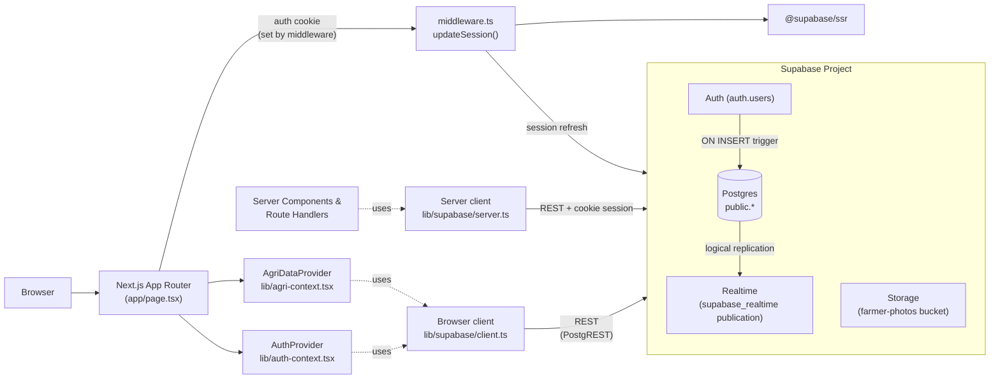
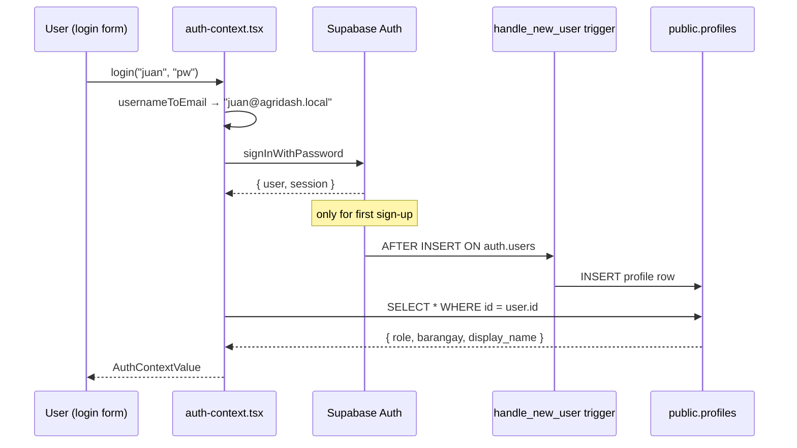
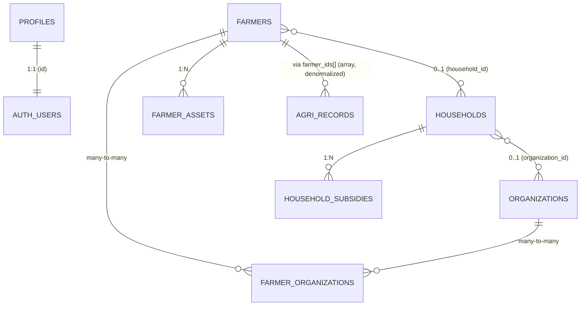

# Database Architecture

How AgriDash connects to and uses Supabase. This document describes the actual wiring as of Phase Next (Activity Timeline & Operational History) — not aspirations.

## 1. Runtime topology



The client never talks to a custom backend. Every read/write goes directly from React → `@supabase/ssr` → PostgREST, gated by Row-Level Security policies. There is no edge function and no server action proxying database access today.

## 2. Supabase services in use

| Service | How it's used | Where |
|---|---|---|
| **Auth** | Email+password sign-in via `auth.users`. Username is mapped to a synthetic email `<username>@agridash.local`. | `lib/auth-context.tsx` |
| **Postgres (public schema)** | Primary data store. All app data lives in `public.*` tables. | `lib/agri-context.tsx` |
| **Row-Level Security** | Per-row visibility tied to the caller's role + barangay. SQL helper functions read the JWT claims. | every migration touching `public.*` |
| **Realtime publication** | All seven data tables are added to the `supabase_realtime` publication. | migrations 001, 002, 007 + `scripts/full-setup.sql` |
| **Storage** | Single public bucket `farmer-photos` for `photo_url` on `public.farmers`. | `migrations/STORAGE.md` |

**Realtime client subscription status** — *not active*. A grep across the repo for `supabase.channel(` and `postgres_changes` returns zero hits. The publication is configured at the database level so a future subscriber would receive events, but no React component subscribes today; the data layer is initial-fetch + manual refetch on mutation.

## 3. Connection layers (`lib/supabase/*`)

Four files, each with a single responsibility:

### `env.ts`
Reads `NEXT_PUBLIC_SUPABASE_URL` and the publishable/anon key from `process.env`. Used by every other file in the folder. Falls back to `""` and logs a missing-env warning rather than throwing, so dev still boots with a clearer error than a network failure.

### `client.ts`
Browser-side client built with `createBrowserClient` from `@supabase/ssr`. Singleton — instantiated once and reused. Exported two ways:

```ts
getSupabaseBrowserClient()  // explicit accessor
supabase                    // lazy Proxy for legacy `import { supabase }` callers
```

Throws if accessed during SSR (`typeof window === "undefined"`), preventing accidental server-side use.

### `server.ts`
Used in Server Components and Route Handlers. Builds a `createServerClient` bound to the **current request's cookie jar** via Next's `cookies()`. This is how the session that the middleware refreshed becomes visible to server-rendered code.

### `middleware.ts` → `updateSession(request)`
Runs on every navigation (wired in `middleware.ts` at the repo root). Constructs a one-shot server client bound to the request/response cookies, calls `supabase.auth.getUser()` to refresh the JWT, and writes any rotated cookies back into the response. Without this step, sessions would silently expire on the next page load.

## 4. Auth flow



- **Synthetic emails**: usernames are converted to `<username>@agridash.local`. Users never type an email. (`lib/auth-context.tsx`, `usernameToEmail()`)
- **Profiles**: `public.profiles` mirrors `auth.users` with role + barangay. The mirror is maintained by the `handle_new_user` trigger installed in `migrations/006_auto_profile_trigger.sql`. The first auth user is auto-promoted to `SUPER_ADMIN`.
- **Roles**: `SUPER_ADMIN` | `ADMIN` | `BARANGAY_USER`. Used both for UI scoping (`isBarangayUser`, `isAdmin`, etc.) and for RLS policy decisions.
- **JWT → RLS**: the JWT's `sub` is the `auth.uid()`. Two SQL helpers — `public.get_user_role()` and `public.get_user_barangay()` — read the role/barangay from the matching profile row inside policy expressions.

## 5. Row-Level Security

RLS is enabled on every data table. The policy shape is consistent:

```sql
USING (
  public.get_user_role() IN ('SUPER_ADMIN', 'ADMIN')
  OR barangay = public.get_user_barangay()
)
```

| Table | Visibility | Mutation |
|---|---|---|
| `organizations` | Public to all authenticated users for SELECT | Admin-or-above only (Phase tightened in `004_organizations_admin_only.sql`) |
| `households` | Own barangay, or admin-or-above | Same |
| `farmer_organizations` | Inherits the farmer's barangay scope | Same |
| `household_subsidies` | Inherits the household's barangay scope | Same |
| `farmer_assets` | Inherits the farmer's barangay scope | Same |
| `agri_records` | Own barangay, or admin-or-above (migration `016`) | Same; `WITH CHECK` on INSERT/UPDATE prevents writing rows tagged with another barangay |
| `activity_logs` | Own barangay, or admin-or-above (migration `019`) | INSERT only — barangay user must tag the row with their own barangay; admins can tag any (including the `'ALL'` sentinel for cross-barangay org actions). **No UPDATE or DELETE policies** — logs are immutable for every authenticated caller; privileged cleanup runs via the service role only. |
| `profiles` | Self-row visible; admin-or-above sees all | Self + admin-or-above |

## 6. Database schema

Seven tables in `public.*`, plus `auth.users` from Supabase Auth.



### Core tables

| Table | Purpose | Phase introduced |
|---|---|---|
| `profiles` | Mirror of `auth.users` with role + barangay | Phase 0 (`006_auto_profile_trigger.sql`) |
| `organizations` | Co-ops / associations / household groups | Phase 0 (`001`) |
| `households` | Family unit with planting capacity (`farming_area_hectares`) | Phase 0 (`001`) |
| `farmers` | Individual farmer/fisherfolk profile, FK to household | Phase 0 (pre-existing), columns added in `001` |
| `farmer_organizations` | Many-to-many join | Phase 0 (`001`) |
| `household_subsidies` | Per-household subsidy line items (fertilizer, seeds, cash, etc.) | Phase 0 (`002`) |
| `farmer_assets` | Per-farmer asset inventory (machinery, fishpond, livestock, planting area). For `category='planting_area'` rows: `parcel_label` + `area_hectares` are required at the app layer; the row becomes an operational allocation source. | Phase 0 (`007`, `009` added livestock), reset + GIS-ready columns in Phase A (`018`, `017`) |
| `agri_records` | The core production-cycle record. One row per (farmer set × period × commodity × variety). Optionally links to a LAND asset via `farmer_asset_id` (Phase A). | Phase 0 (pre-existing, heavily extended in Phases 1–2, asset link added in Phase A `017`) |
| `activity_logs` | Append-only operational history. One row per mutation across `agri_records`, `farmers`, `households`, `farmer_assets`, `organizations`, `household_subsidies`, `farmer_organizations` — plus capacity-overflow attempts. RLS-scoped by barangay; immutable. | Phase Next (`019`) |

### `agri_records` column evolution

| Column | Type | Added in | Notes |
|---|---|---|---|
| `id`, `barangay`, `commodity`, `sub_category` | text | original | |
| `farmer_ids` | text[] | original | denormalized; resolved via `farmers` lookup in client |
| `farmer_male`, `farmer_female`, `total_farmers`, `farmer_names` | mixed | original | denormalized counts written by the client |
| `planting_area_hectares`, `harvesting_output_bags`, `damage_pests_hectares`, `damage_calamity_hectares` | numeric | original | crop fields |
| `stocking`, `harvesting_fishery` | numeric | original | fishery (pieces) |
| `pests_diseases`, `calamity`, `remarks` | text | original | |
| `calamity_sub_category` | text | `003` | controlled values: Typhoon/Flood/… |
| `period_month`, `period_year` | int | original | reporting period |
| `lifecycle_status` | text | `010` | legacy: `planted` / `damaged` / `harvested` / `total_loss` |
| `commodity_group` | text | `011` (Phase 1) | `CROP` / `FISHERY` / `LIVESTOCK` — denormalized for filters + RLS-friendly queries |
| `status` | text | `011` (Phase 1) | new canonical: `active` / `harvested` / `damaged` / `archived` |
| `fishery_loss_pieces` | numeric | `011` (Phase 1) | |
| `livestock_stocking_heads`, `livestock_output_heads`, `livestock_dead_heads` | numeric | `011` (Phase 1) | |
| `farmer_asset_id` | uuid (nullable) | `017` (Phase A) | Optional FK to `farmer_assets(id)` with `ON DELETE SET NULL`. When set, the record allocates against that single LAND lot instead of the household pool. Enforced by `trg_validate_record_asset`. |

Constraints (all `NOT VALID` initially, validated by `012` and `014` after backfill):

| Constraint | Phase | Enforces |
|---|---|---|
| `commodity_group_valid` | 1 | enum check |
| `status_valid` | 1 | enum check |
| `fishery_loss_sane`, `livestock_*_sane` | 1 | 0–1,000,000 bounds |
| `fishery_units_valid`, `livestock_units_valid` | 1 | fishery/livestock cannot use hectare or bag fields |
| `crop_damage_leq_area` | 2 | for crop rows, damage ≤ planted area |
| `status_harvest_requires_output` | 2 | `harvested` rows must have output > 0 in the correct unit |
| `status_damage_requires_loss` | 2 | `damaged` rows must have loss > 0 and zero finalized output |

Triggers:

- `agri_records_archived_terminal_trg` (Phase 2, `015`) — `BEFORE UPDATE OF status`. Raises an exception if `OLD.status = 'archived' AND NEW.status <> 'archived'`. Makes archived status terminal.
- `handle_new_user` (Phase 0, `006`) — auto-creates a `profiles` row on `auth.users` insert.
- `trg_validate_record_asset` (Phase A, `017`) — `BEFORE INSERT OR UPDATE OF farmer_asset_id, farmer_ids ON agri_records`. When `farmer_asset_id IS NOT NULL`: requires the linked `farmer_assets` row to have `category='planting_area'` and its `farmer_id` to appear in `agri_records.farmer_ids`. Runs `SECURITY INVOKER` so RLS still gates which assets a user can link. Capacity overflow is **not** enforced here — that stays app-only.

### `farmer_assets` — Phase A columns (migration 017 §3)

| Column | Type | Notes |
|---|---|---|
| `parcel_label` | text | Human-readable label, e.g. `"Farm Lot A"`. Required at app layer for `planting_area`. |
| `parcel_code` | text | Optional external identifier (cadastral / RSBSA / etc.). |
| `geom_geojson` | jsonb | Parcel geometry as GeoJSON. Reserved for the eventual PostGIS swap (Phase E). |
| `centroid_lat`, `centroid_lng` | double precision | Denormalised WGS84 centroid for cheap map markers without parsing the geometry. |

### Views

- `v_land_asset_allocation` (Phase A, `017`) — per-LAND-asset snapshot: `asset_id`, `farmer_id`, `parcel_label`, `total_ha`, `utilized_ha`, `remaining_ha`, `active_record_count`. Only `status='active'` records count toward `utilized_ha`. Created with `WITH (security_invoker = true)` so RLS on `farmer_assets` and `agri_records` inherits to view reads.

### RPCs

- `fn_remaining_land_ha(p_asset_id uuid, p_exclude_record_id uuid DEFAULT NULL)` (Phase A, `017`) — drives live form validation. Returns `area_hectares` minus the sum of active CROP `planting_area_hectares` pointing at the asset; `p_exclude_record_id` is the editing record's own id so its in-flight allocation isn't double-counted. Marked `STABLE SECURITY INVOKER` with a pinned `search_path`. Returns `NULL` if the asset is not visible or not a `planting_area`.

### `activity_logs` — Phase Next schema (migration 019)

| Column | Type | Notes |
|---|---|---|
| `id` | uuid PK | `gen_random_uuid()` default. |
| `entity_type` | text NOT NULL | CHECK-constrained to `agri_record \| farmer \| household \| farmer_asset \| organization \| household_subsidy \| farmer_organization`. Semantic label (not a physical table name) so logs survive table renames. |
| `entity_id` | uuid NOT NULL | UUID of the row in its native table. No FK — seven different parent tables can be referenced (polymorphic association). |
| `action` | text NOT NULL | CHECK-constrained to 13 semantic actions: `created`, `updated`, `deleted`, `status_changed`, `archived`, `land_allocation_changed`, `damage_updated`, `household_transferred`, `allocation_overflow_attempt`, `subsidy_added`, `subsidy_updated`, `subsidy_removed`, `org_membership_changed`. |
| `before` / `after` | jsonb | **Only changed fields**, not full row snapshots. NULL on creates / deletes respectively. ~200 bytes typical per update. |
| `summary` | text | Pre-rendered one-liner for the timeline UI, e.g. `"Status: active → harvested"`. Lets the UI skip JSON parsing for the common case. |
| `performed_by` / `performed_by_name` / `performed_by_role` | uuid / text / text | Actor snapshot at log time. Denormalized so logs survive later profile edits / deletes. `performed_by` is nullable for future `db_trigger`-sourced rows where `auth.uid()` may be NULL. |
| `barangay` | text NOT NULL | RLS scope, copied from the entity at log time. For cross-barangay orgs (admin-only mutations), the sentinel `'ALL'` is used. |
| `source` | text NOT NULL DEFAULT `'app'` | CHECK-constrained to `'app' \| 'db_trigger'`. App-side mutations write `'app'`; `'db_trigger'` is reserved for a future safety-net trigger pack (not built today). |
| `metadata` | jsonb | Free-form attachments — `pool` + `proposed_ha`/`remaining_ha` for overflow attempts; `cascade` counts for parent deletes; `household_id`/`farmer_id` cross-refs on dependent entities. |
| `created_at` | timestamptz NOT NULL DEFAULT `now()` | Server-side clock. |

**Indexes** (composite, `created_at DESC` baked in so newest-first reads are index-only):
- `idx_activity_logs_entity (entity_type, entity_id, created_at DESC)` — drives the per-record Timeline tab.
- `idx_activity_logs_barangay (barangay, created_at DESC)` — drives the cross-cutting User Activity panel.
- `idx_activity_logs_performed_by (performed_by, created_at DESC) WHERE performed_by IS NOT NULL` — partial index for "show me everything user X did".

**Policies**: SELECT + INSERT only. **No UPDATE policy, no DELETE policy** — Postgres default-denies under RLS, making logs append-only for every authenticated caller. The migration's footer documents a manual cleanup pattern (service-role only).

**No triggers**. The Phase Next plan deliberately deferred a DB-trigger safety net; the `source` column reserves room without forcing the trigger path now.

## 7. How a typical operation flows

### Read on dashboard mount

```
1. <AuthProvider> mounts → reads supabase.auth.getUser() from cookie
2. <AgriDataProvider> mounts → SELECT * FROM each table (records, farmers, households, organizations, farmer_organizations, household_subsidies, farmer_assets)
3. Provider derives "visible" slices (vr, vf, vh, vo) by filtering on userBarangay when role = BARANGAY_USER
4. Provider computes Phase 4 aggregations (lifecycleSummary, capacitySummary, damageSummary, etc.) via lib/domain/metrics.ts
5. Children consume via useAgriData()
```

### Write a new record

```
1. RecordFormDialog → recordFormSchema (zod) validates shape + status evidence
   • Phase D: requires farmer_asset_id for NEW CROP records when the farmer has any eligible planting-area asset
2. addRecord(payload) in agri-context.tsx:
   a. computeFarmerFields() — denormalizes farmer_male / farmer_female / total_farmers from the registry
   b. validateHouseholdCropAllocation() — enforces household capacity ceiling for legacy rows (lib/domain/allocation.ts)
      • If rejected with kind='capacity', Phase Next §4 logs an allocation_overflow_attempt before returning
   c. validateLandAssetAllocation() — enforces asset-level capacity + linkage when farmer_asset_id is set (Phase A–D)
      • Same overflow-logging branch on capacity-kind rejection
   d. agriRecordInsertRow() — maps form payload to DB column shape (includes derived lifecycle_status, new status, and farmer_asset_id)
   e. supabase.from("agri_records").insert(...) — server runs CHECK constraints AND trg_validate_record_asset
3. On success:
   a. setRecords(prev => [...prev, newRecord]) — optimistic local update
   b. logActivity({...}) — Phase Next §1 fire-and-forget insert into activity_logs (fail-soft; console-warn on error, never rolls back)
   On error: friendlyDbError() translates Postgres error codes (23514 = CHECK violation) into user-readable messages
```

### Activity log emission (Phase Next)

Every mutation in `agri-context.tsx` follows the same shape — successful Supabase write, then a fire-and-forget `logActivity(...)`:

```
1. lib/activity-log.ts → logActivity(input):
   a. Generates a fresh UUID for the log row (clean correlation key).
   b. Short-circuits empty-diff updates (no fields changed → no log).
   c. Builds the row via lib/insert-rows.ts → activityLogInsertRow().
   d. supabase.from("activity_logs").insert(row).
   e. On error: console.warn(...) and return { ok: false, reason }. NEVER throws.
2. Identity comes from useAuth() snapshotted into actorRef.current (refreshed by effect).
3. RLS gates the INSERT: WITH CHECK requires barangay = caller's barangay (admins bypass).
```

Reads use cursor pagination on `(created_at DESC, id DESC)` — `useActivityLog` for per-entity, `useActivityFeed` for cross-cutting; both in `lib/contexts/activity-context.tsx`.

### Status transition (e.g. active → archived)

```
1. RecordFormDialog status dropdown gates options via canTransition(savedStatus, candidate)
2. On submit, deriveLifecycleFromStatus(status, damageTotal, prevLifecycle) computes the legacy lifecycle_status for back-compat
3. UPDATE agri_records SET status = $new, lifecycle_status = $derived ...
4. If new.status was changing OUT of 'archived', the BEFORE UPDATE trigger (migration 015) raises an exception that surfaces to the form as an error message
```

## 8. Migration timeline

| # | File | Phase | What it adds |
|---|---|---|---|
| 001 | `001_households_orgs.sql` | 0 | households, organizations, farmer_organizations, profiles columns, RLS |
| 002 | `002_household_subsidies.sql` | 0 | per-household subsidies + RLS |
| 003 | `003_calamity_sub_category.sql` | 0 | calamity_sub_category column |
| 004 | `004_organizations_admin_only.sql` | 0 | tighten org write policies |
| 005 | `005_farmer_household_head.sql` | 0 | is_household_head flag |
| 006 | `006_auto_profile_trigger.sql` | 0 | profiles auto-sync trigger |
| 007 | `007_farmer_assets.sql` | 0 | farmer_assets table + RLS |
| 008 | `008_records_check_constraints.sql` | 0 | numeric sanity bounds on agri_records |
| 009 | `009_farmer_assets_livestock.sql` | 0 | livestock category for farmer_assets |
| 010 | `010_records_lifecycle_status.sql` | 0 | lifecycle_status column (legacy: planted/damaged/harvested/total_loss) |
| **011** | `011_phase1_domain_model.sql` | **1** | commodity_group, status, fishery_loss_pieces, livestock_*_heads (all NOT VALID) |
| **012** | `012_validate_phase1_constraints.sql` | **1** | flips Phase 1 constraints to VALIDATED after backfill |
| **013** | `013_phase2_domain_enforcement.sql` | **2** | crop_damage_leq_area, status_harvest_requires_output, status_damage_requires_loss |
| **014** | `014_validate_phase2_constraints.sql` | **2** | flips Phase 2 constraints to VALIDATED |
| **015** | `015_archived_terminal_trigger.sql` | **2** | BEFORE UPDATE OF status trigger; makes archived terminal |
| **016** | `016_agri_records_rls.sql` | **5 (security)** | Enables RLS on `agri_records`; SELECT/INSERT/UPDATE/DELETE policies + barangay index. Includes a pre-flight check that refuses to enable RLS if any row has `NULL` barangay. |
| **017** | `017_land_allocation.sql` | **A (Land Asset Allocation)** | Adds `agri_records.farmer_asset_id` (nullable FK) + partial index; `trg_validate_record_asset` BEFORE INSERT/UPDATE trigger; reserves five GIS-ready columns on `farmer_assets` (`parcel_label`, `parcel_code`, `geom_geojson`, `centroid_lat/_lng`); creates `v_land_asset_allocation` view (`security_invoker=true`) and `fn_remaining_land_ha` RPC. Idempotent — section 3 also adds `area_hectares` defensively, so it self-heals if 007 was applied incompletely. |
| **018** | `018_farmer_assets_reset.sql` | **A (Land Asset Allocation, reconciliation)** | One-time reset of `farmer_assets` when the table was bootstrapped out-of-band with a diverged shape (`asset_type` instead of `category`, `size_or_quantity` instead of separate `quantity`/`area_hectares`, plus extra `name`/`location` columns) that didn't match migrations 007/009 or the app code. Drops with CASCADE (data is verified 0 rows before running), recreates the canonical schema with the GIS-ready columns from 017, and restores RLS + realtime. Run before re-applying 017. |
| **019** | `019_activity_logs.sql` | **Next (Activity Timeline & Operational History)** | Adds `public.activity_logs` (append-only audit table) + three composite indexes + SELECT/INSERT RLS policies (no UPDATE/DELETE — logs are immutable by Postgres default-deny). CHECK constraints lock down `entity_type`, `action`, `source`. Realtime publication membership added. App-side primary; `source = 'db_trigger'` reserved for a future safety-net trigger that's not built today. |

Phases 3 (UI) and 4 (analytics) added no migrations — pure app-layer work. Phase 5 is security hardening. Phase A (Land Asset Allocation) introduces migrations 017–018; Phase E (PostGIS swap) is deferred. Phase Next (Activity Timeline) introduces migration 019; the optional DB-trigger safety net for it is also deferred.

## 9. Environment

Required env vars in `.env.local`:

```
NEXT_PUBLIC_SUPABASE_URL=https://<project-ref>.supabase.co
NEXT_PUBLIC_SUPABASE_ANON_KEY=<anon-or-publishable-key>
# Either ANON_KEY or PUBLISHABLE_KEY — env.ts falls back between them.
```

Both are inlined into the client bundle by Next.js. There is no service-role key in the client — and there shouldn't be.

## 10. File map (where each piece lives)

```
agri-dashboard/
├── lib/
│   ├── supabase/
│   │   ├── env.ts          ← reads NEXT_PUBLIC_SUPABASE_* env vars
│   │   ├── client.ts       ← browser singleton (createBrowserClient)
│   │   ├── server.ts       ← request-bound server client (cookies)
│   │   └── middleware.ts   ← per-request session refresh
│   ├── auth-context.tsx    ← AuthProvider: login, role, barangay
│   ├── agri-context.tsx    ← AgriDataProvider: loads all tables, derives metrics
│   ├── data.ts             ← AgriRecord / Farmer / Household types + COMMODITY_COLORS
│   └── domain/
│       ├── metrics.ts      ← Phase 4 aggregators (traceAggregation-wrapped)
│       ├── lifecycle.ts    ← status predicates + transition table
│       ├── status.ts       ← RecordStatus enum + labels
│       ├── allocation.ts   ← household capacity validator
│       ├── invariants.ts   ← reporting invariants (check + assert pairs)
│       ├── severity.ts     ← per-group damage severity classifiers
│       ├── utilization.ts  ← capacity utilization helpers
│       ├── audit.ts        ← traceAggregation + WithMeta wrapper
│       ├── validation.ts   ← domain-level Zod + cross-field rules
│       ├── units.ts        ← Unit type + cropBagsToMetricTons
│       └── commodity.ts    ← CommodityGroup mapping
├── middleware.ts           ← wires lib/supabase/middleware.ts into Next.js
├── migrations/
│   ├── 001_… through 019_… ← SQL files run in Supabase SQL Editor
│   │                         (016 = agri_records RLS; 017 = land allocation;
│   │                          018 = farmer_assets reset; 019 = activity_logs)
│   └── STORAGE.md          ← farmer-photos bucket setup
└── system docs/
    ├── System Architecture.md
    ├── Phase 1 Domain Model.md
    └── Database Architecture.md   ← (this file)
```

## 11. Known gaps and follow-ups

These are tracked here so they don't get lost.

1. **`profiles_update_own` allows users to UPDATE their own role/barangay.** Latent privilege-escalation vector — a BARANGAY_USER could in principle do `UPDATE profiles SET role = 'ADMIN' WHERE id = auth.uid()`. Fix by adding `WITH CHECK (role = OLD.role AND barangay = OLD.barangay)` or moving role/barangay edits to admin-only.
2. **No client-side realtime subscriptions.** Tables are published, but the client never opens a channel. Add `supabase.channel("agri").on("postgres_changes", ...)` in `agri-context.tsx` if you need live updates across browsers.
3. **No audit columns** (`created_by`, `updated_by`) on any table. Aggregation audit lives in-memory via `traceAggregation`'s `__meta` only.
4. **No service role usage on the server.** Server components use the same anon key with the cookie session. Privileged admin operations (e.g. bulk imports) currently happen via the SQL Editor, not via the app.
5. **Singleton browser client is module-scoped, not per-tab-isolated.** If you ever need multi-account sign-in, change the singleton pattern in `client.ts`.
6. **Allocation capacity is app-only.** `validateHouseholdCropAllocation` and `validateLandAssetAllocation` both run in `lib/agri-context.tsx` mutations, not in Postgres. The Phase A trigger (`trg_validate_record_asset`) enforces the asset linkage rules but **not** the capacity sum — direct SQL inserts could still overflow. If defense-in-depth is needed, add a `BEFORE INSERT OR UPDATE` trigger on `agri_records` that aggregates active CROP `planting_area_hectares` per asset (and per household, for legacy rows) and raises on overflow.
7. **`scripts/schema.sql` is partial.** Bootstraps only `farmers`/`households`/`agri_records` — does not include `farmer_assets`, `household_subsidies`, `commodity_group`, Phase 2 `status`, or `agri_records` RLS. Anyone running it cold needs migrations 002–018 applied separately. Migration 018 exists specifically to reconcile a real environment where this gap produced a diverged `farmer_assets` shape.
8. **Phase E — PostGIS swap.** `farmer_assets` already reserves `geom_geojson` (JSONB) and `centroid_lat/_lng`. When real spatial queries are wanted: install PostGIS, add `geom geography(MultiPolygon, 4326)`, backfill from `geom_geojson` via `ST_GeomFromGeoJSON`, and add `ST_Intersects` checks for true overlap. No migration committed for this step.
9. **Activity-log DB-trigger safety net.** Phase Next §6 deliberately deferred a per-table BEFORE INSERT/UPDATE/DELETE trigger pack that would catch direct service-role SQL writes (the only surface not covered by app-side logging today). Schema reserves `source = 'db_trigger'` and the column-level shape so the trigger pack can be added without further migration churn. Defer until automated server-side writes become routine.
10. **Activity-log retention is manual.** `activity_logs` grows unbounded; migration 019's footer documents a manual cleanup pattern but no auto-prune is installed. If table size becomes a concern (year 3+), partition by month — the API surface (RLS, indexes, app code) stays unchanged.

---

*Last updated 2026-05-14 after Phase Next (Activity Timeline). When the schema changes, update §6 and §8. When the connection style changes (e.g. adding realtime), update §1 and §3.*
