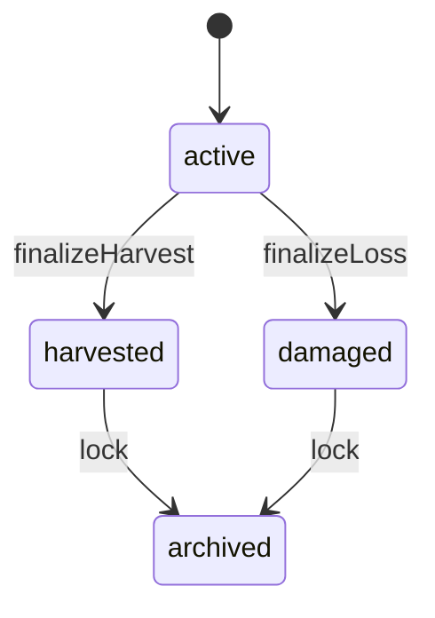

# Phase 1 — Domain Model Stabilization

This document defines **Phase 1** of the architecture refactor for **Raze AgroDash**. The goal is to introduce commodity groups, a lifecycle/status model aligned with reporting, and commodity-specific output/damage fields **without a destructive rewrite**.

## Goals (Phase 1 only)

- Add **commodity groups**: `CROP | FISHERY | LIVESTOCK`
- Add a **production lifecycle status**: `active | harvested | damaged | archived`
- Introduce **commodity-specific outputs/damage** fields
- Centralize **validation** and field visibility rules
- Keep dashboards/exports/print working via **backward compatibility**

Non-goals: GIS, AI/forecasting, advanced analytics.

## 1) Commodity groups

### Mapping

| Commodity | Group |
|---|---|
| Rice | CROP |
| Corn | CROP |
| High Value Crops | CROP |
| Industrial Crops | CROP |
| Fishery | FISHERY |
| Livestock | LIVESTOCK |

### Why groups exist

- Units differ (hectares/bags vs pieces vs heads)
- Damage semantics differ (ha vs pieces loss vs heads dead)
- UI fields differ per group
- Aggregations must avoid mixing incompatible units

## 2) Lifecycle/status model

### Status values (Phase 1 canonical)

- **active**: ongoing production cycle (operational workflow)
- **harvested**: finalized success (counts in official production)
- **damaged**: finalized failure/loss (counts in official damage/loss reports)
- **archived**: locked historical record (read-only; excluded from operational workflows)

### Reporting semantics

- Only **harvested** contributes to official production totals.
- Only **damaged** contributes to official loss totals.
- **active** contributes only to operational monitoring (in-field KPIs).
- **archived** is excluded from “active workflows” but may be included in historical reports by explicit filter.

### Transition rules (recommended)

## 3) Commodity-specific fields (Phase 1)

### CROPS

- `planting_area_hectares`
- `harvest_bags` (keep existing `harvesting_output_bags` for compatibility)
- `damage_hectares` (keep existing `damage_pests_hectares`, `damage_calamity_hectares`)

### FISHERY (pieces)

- `fishery_stocking` (existing: `stocking`)
- `fishery_harvest_pieces` (existing: `harvesting_fishery`)
- `fishery_loss_pieces` (**new**) — finalized loss count

### LIVESTOCK (heads)

- `livestock_stocking_heads` (**new**)
- `livestock_output_heads` (**new**)
- `livestock_dead_heads` (**new**)

## 4) Backward compatibility strategy

Phase 1 is additive:

- Add new DB columns; keep legacy columns.
- Add mapping helpers:
  - old `lifecycle_status` → new `status`
  - old fishery fallback-to-bags is removed; fishery uses pieces only.
- Update aggregations/KPIs to be unit-aware (split outputs by group).

## 5) Double-counting prevention (Phase 1)

- Production totals must only sum **harvested** records.
- Loss totals must only sum **damaged** records.
- Active monitoring KPIs must only sum **active** records.
- Never combine crop bags/MT with fishery pieces or livestock heads into one number.

## 6) Rollout order (Phase 1)

1. Add domain enums/types + mapping helpers in TypeScript.
2. Add non-destructive SQL migration (new columns + constraints, NOT VALID where needed).
3. Centralize commodity rules (field visibility + validation).
4. Update UI form + KPI/analytics + export/print to read the new domain model.
5. Monitor legacy rows; backfill as needed.

