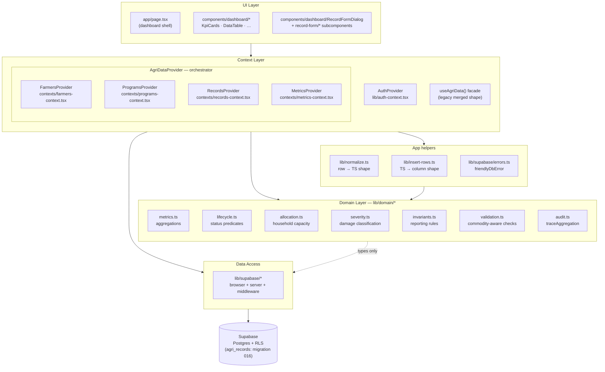
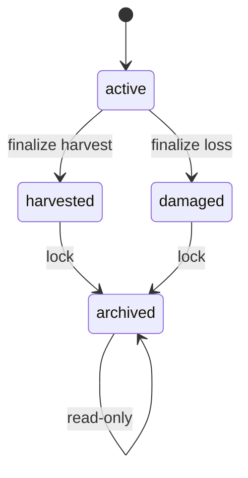
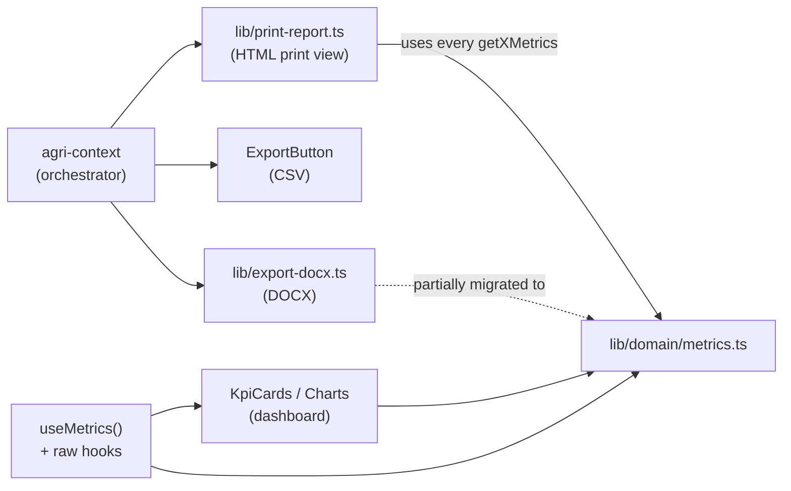
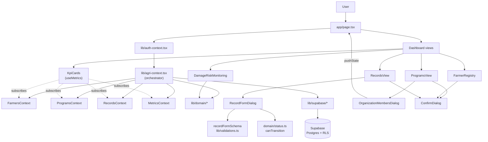

# System Architecture

How **Raze AgroDash** is structured at the application layer: layers, modules, data flow, validation, and conventions. This document focuses on the *application* — for the database side (tables, RLS, migrations, Supabase connection topology), see **`Database Architecture.md`**. For the canonical Phase 1 domain spec, see **`Phase 1 Domain Model.md`**.

Last updated 2026-05-11 after Phase 5 (provider refactor + RLS hardening).

## 1) Tech stack

- **Next.js 16 (App Router, Turbopack)** — `app/` directory routes; client-first dashboard.
- **React 19 + TypeScript** — strict mode, function components.
- **Tailwind CSS 4 + Radix UI** — utility-first styling with Radix primitives for dialogs/select/tabs.
- **Zod 4** — schema validation for forms and domain payloads.
- **Recharts 3** — dashboard charts.
- **Supabase (`@supabase/ssr` + `@supabase/supabase-js` 2.x)** — Auth + Postgres + RLS. See `Database Architecture.md` for connection details.
- **docx** — DOCX exports.

Two flat directories carry the bulk of the application logic:

```
lib/        — data, domain, supabase, auth, helpers
components/ — dashboard views, dialogs, UI primitives
```

## 2) Layered architecture



Strict directionality: **UI → context → domain + helpers + data access → Supabase**. The domain layer has no React imports and no Supabase calls — it operates on plain TS values so it can be unit-tested (see `scripts/test-metrics.ts`, 54 passing tests).

After Phase 5, the context layer has **four split contexts** that share an outer orchestrator (`AgriDataProvider`). New components subscribe to the narrow hook they need; `useAgriData()` remains as a legacy merge facade.

## 3) Domain layer (`lib/domain/*`)

The single most important architectural artifact of the Phase 1–4 refactor. Every business rule lives here, isolated from React and from Supabase.

| Module | Exports | Used by |
|---|---|---|
| `commodity.ts` | `CommodityGroup` (`CROP`/`FISHERY`/`LIVESTOCK`), `commodityGroupForCommodity()` | everywhere |
| `commodityRules.ts` | `RULES` per group (labels, base/output/loss units) | form labels |
| `status.ts` | `RecordStatus` (`active`/`harvested`/`damaged`/`archived`), labels, chip styles, `canTransition()` | form dropdown, badges, table chips |
| `lifecycle.ts` | predicates `countsTowardFinalizedProduction`, `countsTowardDamageReports`, `consumesActiveAllocation`, `isHistoricalOnly` + evidence rules + transition table | every aggregator |
| `metrics.ts` | `getCropMetrics`, `getFisheryMetrics`, `getLivestockMetrics`, `getDamageMetrics`, `getDamageSummary`, `getBarangaySummary`, `getLifecycleSummary`, `getCapacitySummary`, `getProductionByCommodity`, `getRiskRanking`, `getTopCommodity` | KpiCards, agri-context, print-report, export |
| `utilization.ts` | `householdUtilization`, `barangayUtilization`, `municipalUtilization`, `releasedCropAreaHa` | `getCapacitySummary` |
| `allocation.ts` | `validateHouseholdCropAllocation`, `sumHouseholdActiveCropAllocationHa`, `canAllocateCropActiveHa`, `findConflictingActiveCropCycle` | `addRecord` / `updateRecord` in agri-context |
| `severity.ts` | `classifyCropDamageSeverity`, `classifyFisheryLossSeverity`, `classifyLivestockLossSeverity`, `maxSeverity`, chip styles | damage views, risk ranking |
| `validation.ts` | `validateDomainRecord` returning structured `DomainIssue[]` | wired but not consumed yet |
| `units.ts` | `Unit`, `cropBagsToMetricTons` (the **only** unit converter; no fishery↔MT, no livestock↔MT) | metrics, charts |
| `invariants.ts` | 7 `check*`/`assert*` pairs (mixed-units, active-excluded, finalized-has-output, damage ≤ planted, household capacity, fishery never MT, only crop converts to MT) | tests; available for runtime assertions |
| `audit.ts` | `traceAggregation`, `WithMeta`, `formatAggregationMeta` | wraps every metric function |
| `index.ts` | Barrel | downstream imports |

### 3.1 Commodity groups

Three groups, derived from `commodity` (Rice / Corn / High Value Crops / Industrial Crops / Fishery / Livestock):

| Group | Base unit | Output unit | Loss unit |
|---|---|---|---|
| `CROP` | hectares | bags (40 kg) | hectares |
| `FISHERY` | pieces | pieces | pieces |
| `LIVESTOCK` | heads | heads | heads |

No converter exists between groups — bags can become MT (×0.04), but pieces and heads have no weight equivalent. This is enforced both by code (`units.ts` only ships one converter) and by the `INV-6`/`INV-7` invariants in `invariants.ts`.

### 3.2 Lifecycle status

Four states with a strict transition table:



| State | Counts toward production? | Counts toward damage? | Consumes capacity? |
|---|---|---|---|
| `active` | ❌ | depends | ✅ |
| `harvested` | ✅ | residual only | ❌ |
| `damaged` | ❌ | ✅ | ❌ |
| `archived` | ❌ | ❌ | ❌ |

Server-side enforcement: `status_harvest_requires_output`, `status_damage_requires_loss`, and the `BEFORE UPDATE` trigger `agri_records_archived_terminal_trg` (migrations 013, 015 — see `Database Architecture.md` §6).

Client-side: the form dropdown disables impossible transitions via `canTransition(savedStatus, candidate)`.

Backward compatibility: every record carries **both** `status` (Phase 2 canonical) and `lifecycle_status` (legacy `planted`/`damaged`/`harvested`/`total_loss`). `lib/domain/status.ts:recordStatusFromLifecycleStatus()` maps legacy→new; `RecordFormDialog:deriveLifecycleFromStatus()` maps new→legacy on submit.

### 3.3 Metrics & aggregation

Every metric function is **wrapped in `traceAggregation()`** (`audit.ts`). The result carries a non-enumerable `__meta` with label, timing, and record count. Set `NEXT_PUBLIC_DEBUG_METRICS=1` to log a console trace per call. The print report's footer formats this metadata.

Aggregations are **group-scoped**: `getCropMetrics` only touches CROP rows, `getFisheryMetrics` only FISHERY, etc. There is no function that returns a single "total production" number — it's always returned as `{ cropBags, cropTons, fisheryPieces, livestockHeads }` with each value carrying its unit.

### 3.4 Allocation & capacity

`households.farming_area_hectares` is the per-household ceiling. The sum of `planting_area_hectares` over all CROP records attributed to the household via `farmer_ids → farmers.household_id` (and whose status is `active`) must not exceed the ceiling.

Enforcement runs in `agri-context.tsx` at both `addRecord` and `updateRecord` paths via `validateHouseholdCropAllocation`. Rejection surfaces to `RecordFormDialog`'s `errorMsg` banner with the remaining capacity stated explicitly.

There is no DB-level constraint for this — app-only. Direct SQL inserts bypass it.

### 3.5 Severity & risk ranking

Per-group classifiers in `severity.ts` produce `LOW`/`MODERATE`/`HIGH`/`CRITICAL`. Crops use absolute hectare thresholds; fishery and livestock use a percentage of stocking when known, falling back to absolute counts otherwise.

`getRiskRanking` returns a per-barangay row with worst-of-three severity (crop / fishery / livestock) plus the underlying numbers. Currently consumed by the print report; **not yet rendered on the live dashboard**.

## 4) Top-level UI composition

- **Dashboard shell**: `app/page.tsx`
  - Renders tabs (Overview, Damage & Risk, Farmers, Records, Programs, etc.)
  - Maintains tab state and syncs tab selection into the URL query (`?tab=`).
  - Supports deep-linking into Farmers via `?tab=farmers&farmerId=...&orgId=...`.

- **KPI strip**: `components/dashboard/KpiCards.tsx` — 7 tiles after Phase 4:
  1. Total farmers
  2. Crop production (MT headline, bags + fishery + livestock counts in hint)
  3. Planting area
  4. Damaged area
  5. Top commodity
  6. **Capacity utilization** (Phase 4 — % + ha breakdown + over-allocated flag)
  7. **Active records** (Phase 4 — count + lifecycle hint)

  Filters by barangay or date are passed in as props; the component re-runs aggregations on the filtered slice.

- **Record form**: `components/dashboard/RecordFormDialog.tsx` + `components/dashboard/record-form/*` subcomponents
  - Commodity-aware field rendering: `CropFields`, `FisheryFields`, `LivestockFields` are conditionally shown based on the commodity group.
  - **Status dropdown** drives validation and lifecycle. Editing an existing record disables transitions disallowed from its saved status.
  - **StatusBadge** in the header reflects the live form status.
  - Numeric evidence fields auto-lock when the chosen status is `harvested`, `damaged`, or `archived`.

## 5) Context layer

### 5.1 `AuthProvider` (`lib/auth-context.tsx`)

Wraps Supabase Auth with synthetic emails (`<username>@agridash.local`) and exposes `role` (`SUPER_ADMIN` | `ADMIN` | `BARANGAY_USER`) + `userBarangay`. See `Database Architecture.md` §4 for the full flow.

### 5.2 `AgriDataProvider` — orchestrator (`lib/agri-context.tsx`)

After Phase 5, `AgriDataProvider` is the **orchestrator** that owns:

- Initial Supabase load on auth state change (parallel `Promise.all` of 7 tables)
- Module state (`useState` for each table)
- Refs to latest state (`farmersRef`, `recordsRef`, `householdsRef`) used by mutations to avoid re-renders
- **Barangay-scoped visible slices** (`vr`, `vf`, `vh`, `vo`, `vSubs`, `vAssets`)
- All cross-cutting mutations (e.g. `deleteFarmer` touches records / orgs / assets / farmer_organizations atomically)
- Helper accessors (`getFarmersByIds`, `getHousehold`, `getSubsidiesForHousehold`, etc.)
- Provider composition: nests the four split providers below

It exposes nothing directly — consumers always go through one of the four narrow contexts or the legacy facade.

### 5.3 The four split contexts (Phase 5)

Each lives in `lib/contexts/*-context.tsx`. They're nested by AgriDataProvider in this order so each layer's hooks are available to the next:

```tsx
<FarmersProvider value={farmersValue}>           {/* farmers + assets + farmer_orgs */}
  <ProgramsProvider value={programsValue}>       {/* households + orgs + subsidies */}
    <RecordsProvider value={recordsValue}>       {/* agri_records + 3 mutations */}
      <MetricsProvider>                          {/* derived summaries; reads via hooks */}
        {children}
      </MetricsProvider>
    </RecordsProvider>
  </ProgramsProvider>
</FarmersProvider>
```

| Context | Hook | Owns |
|---|---|---|
| `FarmersContext` | `useFarmers()` | `farmers`, `farmerOrganizations`, `farmerAssets` + 8 mutations (`addFarmer`, `updateFarmer`, `deleteFarmer`, `getFarmersByIds`, `getOrganizationIdsForFarmer`, `saveFarmerOrganizations`, `addFarmerAsset`, `updateFarmerAsset`, `deleteFarmerAsset`, `getAssetsForFarmer`) |
| `ProgramsContext` | `usePrograms()` | `households`, `organizations`, `householdSubsidies` + 10 mutations (`addHousehold`/`updateHousehold`/`deleteHousehold`, org CRUD, subsidy CRUD, `getHousehold`, `getSubsidiesForHousehold`) |
| `RecordsContext` | `useRecords()` | `records` + `addRecord` / `updateRecord` / `deleteRecord` |
| `MetricsContext` | `useMetrics()` | 22 derived summaries: `totalProduction`, `totalFarmers`, `damageSummary`, `lifecycleSummary`, `capacitySummary`, `damageRiskData`, `productionByCommodity`, `organizationStats`, etc. |

The three data contexts are *prop-fed* by AgriDataProvider (so values are bundled in one place; cross-cutting mutations remain coordinated). `MetricsProvider` is *hook-fed* — it sits innermost and reads via `useFarmers()` + `usePrograms()` + `useRecords()` (Phase E flip).

### 5.4 `useAgriData()` — legacy facade

Returns the merged shape of all four contexts:

```ts
export function useAgriData():
  & FarmersContextValue
  & ProgramsContextValue
  & RecordsContextValue
  & MetricsContextValue
```

Existing components keep working unchanged. New components should prefer the narrow hooks for clearer dependencies and (eventually) better re-render isolation.

### 5.5 Mutation behavior

- **Optimistic updates**: client state updates immediately after DB write succeeds; on error the operation rejects and the form surfaces the message.
- **Error translation**: Postgres errors → user-friendly text via `friendlyDbError()` from `lib/supabase/errors.ts`. CHECK violations (code `23514`) match by constraint name.
- **Cross-cutting cleanups**: deletes mirror the DB-side cascades locally (e.g. `deleteFarmer` strips `farmer_id` from records' `farmer_ids[]` arrays). All cross-cutting mutations live in `agri-context.tsx` so the coordination is in one place.

### 5.6 Component migration pattern (KpiCards example)

`components/dashboard/KpiCards.tsx` is the reference example for migrating off `useAgriData()`. Before/after:

```tsx
// Before — one fat hook
const { totalFarmers, totalProduction, records, farmers, households, … } = useAgriData();

// After — declared dependencies
const { totalFarmers, totalProduction, … } = useMetrics();
const { records } = useRecords();
const { farmers } = useFarmers();
const { households } = usePrograms();
```

Benefit: explicit dependency graph; future re-render optimizations (e.g. `useCallback` wrapping of mutations) will pay off only for components on the narrow hooks.

## 6) Form & validation architecture

Validation runs in **three layers**. A bad record needs to fail all three:

| Layer | Where | Catches |
|---|---|---|
| **Form schema** (Zod) | `lib/validations.ts → recordFormSchema` | Field types, numeric bounds, required fields, status-evidence rules |
| **Domain validator** | `lib/domain/validation.ts → validateDomainRecord` | Commodity-field isolation (CROP can't have fishery/livestock fields, etc.), invariants — *currently defined but not yet wired into the form* |
| **DB constraints** | `migrations/008`, `011`, `013` | CHECK constraints; the last line of defense. `15` has the trigger for archived-terminal. |

Plus a fourth, cross-record check that's app-only:

| Layer | Where | Catches |
|---|---|---|
| **Allocation guard** | `lib/domain/allocation.ts → validateHouseholdCropAllocation` (run in agri-context mutations) | Active crop area across household ≤ `farming_area_hectares` |

## 7) Default sorting rules

All user-facing lists default-sort **A→Z**, case-insensitive, ignoring leading/trailing spaces. Implemented via `lib/sort.ts` + context-level sorting in `lib/agri-context.tsx`:

- **Barangays**: A→Z in dropdowns/pickers.
- **Households**: `display_name` A→Z, fallback to `id` when blank.
- **Organizations / Cooperatives / Associations**: `name` A→Z.
- **Farmers / Members**: last-name-first sorting using a heuristic:
  - last name = last token of `farmers.name`
  - full name is the tie-breaker
  - helpers live in `lib/name.ts`

## 8) Programs module

- **Programs view**: `components/dashboard/ProgramsView.tsx`
  - **Households list**: paginated (per-page selector + page controls)
  - **Organizations list**: paginated (per-page selector + page controls)
  - Member counts are clickable to open the members dialog.

### 8.1 Organization members "where is it now"

- **Members dialog**: `components/dashboard/OrganizationMembersDialog.tsx`
  - Lists members sorted A→Z (last-name-first).
  - Shows current barangay, household (via `getHousehold(farmer.household_id)`), and household-head status.
  - Clicking a member deep-links to the farmer detail view.

## 9) Farmers module

- **Registry**: `components/dashboard/FarmerRegistry.tsx`
  - Supports deep-link open using URL params:
    - `farmerId` → opens that farmer profile
    - `orgId` → shows context "Opened from organization …"
  - Displays names in a **stacked** layout: lastname on top, first+middle below.

## 10) Destructive actions (safety)

- **Confirmation dialog**: `components/ui/ConfirmDialog.tsx`
  - Cancel is default-focused.
  - Danger styling on destructive actions.
  - Optional **type-to-confirm** (trimmed, case-insensitive match).

Used by: delete organization (type org name), delete household (type display name), delete subsidy line item, delete asset line item.

## 11) Reporting & export pipeline



- **Print report** (`lib/print-report.ts`): per-period HTML with KPI strip, production analytics split by group, damage & risk analysis, risk ranking, barangay summary, capacity utilization, and per-barangay sections. Fully Phase 4-aligned.
- **DOCX export** (`lib/export-docx.ts`): still has some inline reducers alongside metrics calls — partial migration.
- **CSV export** (`components/dashboard/ExportButton.tsx`): uses `productionOutputForRecord()` from `lib/data.ts` for per-row export.
- **Dashboard KPIs**: Phase G migrated `KpiCards` to `useMetrics()` + narrow hooks. Other dashboard components still use `useAgriData()` and can be migrated incrementally.

All four callers respect the lifecycle rules: `active` rows never appear in finalized-production sums.

## 12) Runtime flow overview



## 13) Phase evolution

| Phase | Theme | Major additions |
|---|---|---|
| **0** | Foundation | Tables, RLS, auth + profiles, lifecycle_status (legacy column), farmer assets |
| **1** | Domain Model Stabilization | `commodity_group`, new `status`, fishery_loss_pieces, livestock_*_heads, validation parity (`lib/domain/{commodity,commodityRules,status}.ts`) |
| **2** | Validation + Enforcement | `lib/domain/{lifecycle,metrics,validation,units,severity,invariants,audit,allocation,utilization}.ts`, DB CHECK constraints (013) + archived trigger (015) |
| **3** | Commodity-Aware UI | Status dropdown replaces legacy lifecycle dropdown, transition guards in form, status badges, conditional commodity field sections |
| **4** | Reporting Stabilization | Centralized aggregators with `traceAggregation` wrapping, severity classifiers, risk ranking, capacity tile, lifecycle tile, print report rewrite |
| **5** | Provider refactor + security | Split `AgriDataProvider` into 4 contexts (Farmers/Programs/Records/Metrics) with thin domain context files; extracted helpers (`normalize.ts`, `insert-rows.ts`, `supabase/errors.ts`); RLS enabled on `agri_records` (migration 016); `agri-context.tsx` shrunk from 1209 → 766 lines (−37%) |

### Phase 5 sub-steps (provider refactor)

| Step | Done | Result |
|---|---|---|
| A | ✅ | `MetricsProvider` extracted (22 derived memos) |
| B | ✅ | `ProgramsProvider` context (households + orgs + subsidies) |
| C | ✅ | `FarmersProvider` context (farmers + assets + farmer_orgs) |
| D | ✅ | `RecordsProvider` context (agri_records + 3 mutations) |
| E | ✅ | `MetricsProvider` flipped to hook-fed (no more prop drilling) |
| F-lite | ✅ | Helpers extracted to dedicated files |
| G | ✅ | `KpiCards` migrated as reference example |
| H | ⏸️ skipped | `useAgriData()` facade kept for back-compat |

## 14) Key files (index)

### Application root
- `app/page.tsx` — dashboard shell, tab routing, deep-link support
- `app/layout.tsx` — providers (Auth, AgriData), global styles
- `middleware.ts` — Next middleware that delegates to `lib/supabase/middleware.ts`

### Context
- `lib/auth-context.tsx` — Supabase auth wrapper, role + barangay
- `lib/agri-context.tsx` — **orchestrator**: table loader, visible slices, mutations, provider composition, `useAgriData()` facade
- `lib/contexts/farmers-context.tsx` — `FarmersContext` + `useFarmers()` (farmers + assets + farmer_orgs)
- `lib/contexts/programs-context.tsx` — `ProgramsContext` + `usePrograms()` (households + orgs + subsidies)
- `lib/contexts/records-context.tsx` — `RecordsContext` + `useRecords()` (agri_records + record mutations)
- `lib/contexts/metrics-context.tsx` — `MetricsContext` + `useMetrics()` (22 derived summaries; hook-fed via Phase E)

### Domain (Phase 1–4)
- `lib/domain/index.ts` — barrel
- `lib/domain/commodity.ts`, `commodityRules.ts` — group mapping + per-group rules
- `lib/domain/status.ts` — `RecordStatus` enum, labels, transitions
- `lib/domain/lifecycle.ts` — status predicates, evidence rules, transition table
- `lib/domain/metrics.ts` — all aggregators (traceAggregation-wrapped)
- `lib/domain/utilization.ts` — capacity helpers
- `lib/domain/allocation.ts` — household ceiling validator
- `lib/domain/severity.ts` — per-group damage classifiers
- `lib/domain/validation.ts` — domain validator (zod + invariants)
- `lib/domain/invariants.ts` — reporting integrity rules
- `lib/domain/audit.ts` — `traceAggregation`, `WithMeta`
- `lib/domain/units.ts` — `Unit` + crop bags ↔ MT (the only converter)

### Data access
- `lib/supabase/env.ts` · `client.ts` · `server.ts` · `middleware.ts`
- `lib/supabase/errors.ts` — `friendlyDbError()` (Phase F-lite extraction)
- `lib/data.ts` — `AgriRecord` / `Farmer` / `Household` types, `COMMODITY_COLORS`, `LIFECYCLE_STATUSES`
- `lib/normalize.ts` — Supabase-row → TS-type normalizers (Phase F-lite extraction)
- `lib/insert-rows.ts` — TS-type → Supabase column shape builders (Phase F-lite extraction)
- `lib/validations.ts` — `recordFormSchema` (Zod)

### Reports
- `lib/print-report.ts` — HTML print view
- `lib/export-docx.ts` — DOCX export
- `components/dashboard/ExportButton.tsx` — CSV export

### UI utilities
- `lib/sort.ts` — A→Z compare helpers
- `lib/name.ts` — last-name heuristic + display utilities

### Dashboard views
- `components/dashboard/KpiCards.tsx` — 7-tile KPI strip
- `components/dashboard/DataTable.tsx` — records list with status chips
- `components/dashboard/CommodityAnalytics.tsx`
- `components/dashboard/DamageRiskMonitoring.tsx`
- `components/dashboard/ProgramsView.tsx`
- `components/dashboard/OrganizationMembersDialog.tsx`
- `components/dashboard/FarmerRegistry.tsx`
- `components/dashboard/FarmerDistribution.tsx`
- `components/dashboard/SubCategoryAnalytics.tsx`
- `components/dashboard/FindingMatrix.tsx`
- `components/dashboard/DailySummaryCalendar.tsx`

### Dialogs
- `components/dashboard/RecordFormDialog.tsx`
- `components/dashboard/record-form/{StatusBadge,CropFields,FisheryFields,LivestockFields,Field}.tsx`
- `components/dashboard/FarmerFormDialog.tsx`
- `components/dashboard/HouseholdBrowseDialog.tsx`
- `components/dashboard/HouseholdEditDialog.tsx`
- `components/dashboard/FarmerSelectDialog.tsx`
- `components/ui/ConfirmDialog.tsx`
- `components/ui/DialogPortal.tsx`

### Tests & scripts
- `scripts/test-metrics.ts` — Phase 4 smoke tests (54 cases, all passing)
- `scripts/seed-supabase-bulk.ts` — bulk seed for dev

## 15) Where to look next

| If you want to … | Read |
|---|---|
| Understand the DB connection, RLS, schema | `Database Architecture.md` |
| Read the canonical domain spec | `Phase 1 Domain Model.md` |
| Trace a metric back to source | `lib/domain/metrics.ts` + `scripts/test-metrics.ts` |
| Add a new record type | start with `lib/data.ts:AgriRecord`, then `commodity.ts`, then `RecordFormDialog` |
| Tighten validation | `lib/validations.ts` (form) + `lib/domain/validation.ts` (domain) + a migration in `migrations/` |
| Migrate a component off `useAgriData()` | See KpiCards (`components/dashboard/KpiCards.tsx`) as reference — declare narrow hook deps |
| Add a new context slice | `lib/contexts/*-context.tsx` for the type/provider/hook + bundle the value object in `agri-context.tsx` |

## 16) Known follow-ups (not yet done)

1. **`useCallback` wrap on mutations** — currently mutations re-create per render, so the per-provider `value` objects also re-create. Wrapping mutations in `useCallback` would let the value memos stabilize and finally deliver true re-render isolation across narrow hook subscribers.
2. **Full state separation (true Phase F)** — moving state ownership into each provider file would slim `agri-context.tsx` to ~30 lines. Requires resolving cross-cutting mutations (`deleteFarmer` etc.) via shared refs or callback wiring. Estimated 6–10 hours; deferred until clearly needed.
3. **More component migrations off `useAgriData()`** — `CommodityAnalytics`, `DamageRiskMonitoring`, `DataTable`, `ProgramsView`, `FarmerRegistry` still use the facade. KpiCards is the only migrated component.
4. **`validateDomainRecord` is dormant** — defined in `lib/domain/validation.ts` but not yet wired into the form. The form still uses `recordFormSchema` from `lib/validations.ts` for client validation.
5. **DOCX export partial migration** — `lib/export-docx.ts` still has some inline reducers alongside metrics calls.
6. **`profiles_update_own` escalation vector** — see `Database Architecture.md` §11; latent privilege escalation if a BARANGAY_USER updates their own role/barangay.
