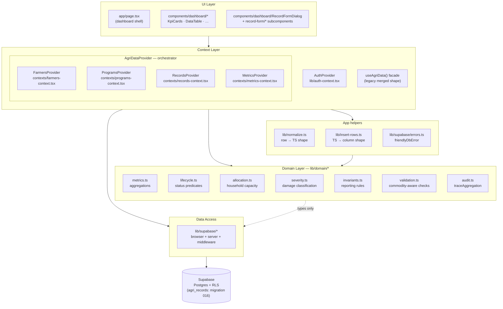
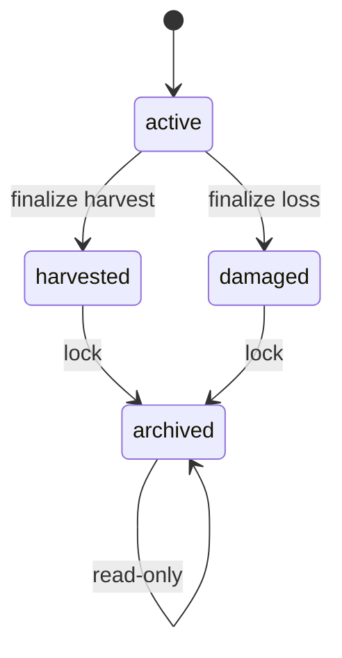
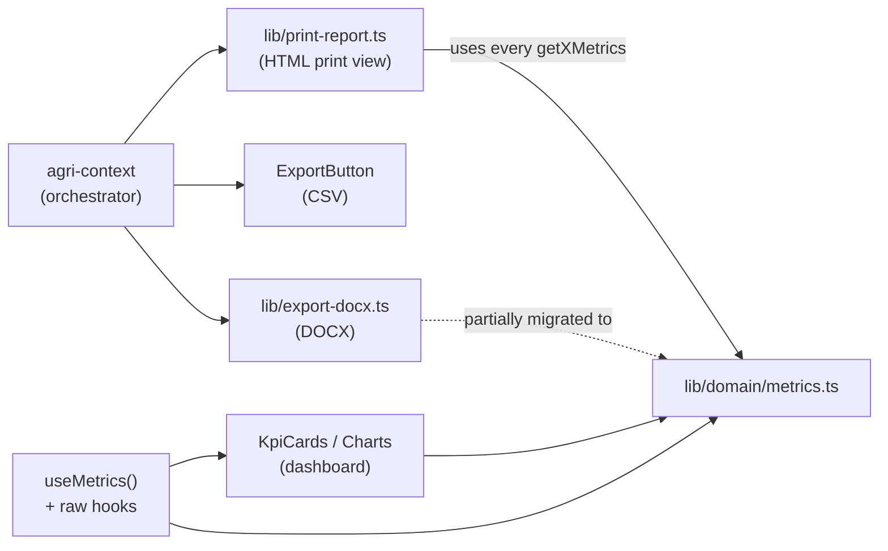
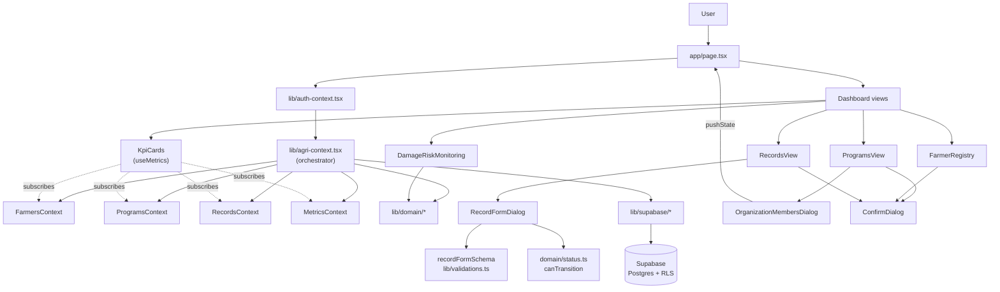

# System Architecture

How **Raze AgroDash** is structured at the application layer: layers, modules, data flow, validation, and conventions. This document focuses on the *application* — for the database side (tables, RLS, migrations, Supabase connection topology), see **`Database Architecture.md`**. For the canonical Phase 1 domain spec, see **`Phase 1 Domain Model.md`**.

Last updated 2026-05-18 after Pilot Hardening Week 1–3 (operational visibility, UX softening, and resilience): global error boundary, `app_errors` table + `reportError` helper, `validateDomainRecord` wired client + server, soft delete on core tables + admin restore page, data-quality warnings module, confirm-on-finalize, session-expiry banner, white-screen-on-reload fix (try/catch + skeleton + 10s timeout in AuthProvider; per-provider crash isolation), activity-log retry queue with localStorage fallback, provider-load error banner with Retry, backup runbook + staging env documentation.

## 1) Tech stack

- **Next.js 16 (App Router, Turbopack)** — `app/` directory routes; client-first dashboard.
- **React 19 + TypeScript** — strict mode, function components.
- **Tailwind CSS 4 + Radix UI** — utility-first styling with Radix primitives for dialogs/select/tabs.
- **Zod 4** — schema validation for forms and domain payloads.
- **Recharts 3** — dashboard charts.
- **Supabase (`@supabase/ssr` + `@supabase/supabase-js` 2.x)** — Auth + Postgres + RLS. See `Database Architecture.md` for connection details.
- **docx** — DOCX exports.

Two flat directories carry the bulk of the application logic:

```
lib/        — data, domain, supabase, auth, helpers
components/ — dashboard views, dialogs, UI primitives
```

## 2) Layered architecture



Strict directionality: **UI → context → domain + helpers + data access → Supabase**. The domain layer has no React imports and no Supabase calls — it operates on plain TS values so it can be unit-tested (see `scripts/test-metrics.ts`, 54 passing tests).

After Phase 5, the context layer has **four split contexts** that share an outer orchestrator (`AgriDataProvider`). New components subscribe to the narrow hook they need; `useAgriData()` remains as a legacy merge facade.

## 3) Domain layer (`lib/domain/*`)

The single most important architectural artifact of the Phase 1–4 refactor. Every business rule lives here, isolated from React and from Supabase.

| Module | Exports | Used by |
|---|---|---|
| `commodity.ts` | `CommodityGroup` (`CROP`/`FISHERY`/`LIVESTOCK`), `commodityGroupForCommodity()` | everywhere |
| `commodityRules.ts` | `RULES` per group (labels, base/output/loss units) | form labels |
| `status.ts` | `RecordStatus` (`active`/`harvested`/`damaged`/`archived`), labels, chip styles, `canTransition()` | form dropdown, badges, table chips |
| `lifecycle.ts` | predicates `countsTowardFinalizedProduction`, `countsTowardDamageReports`, `consumesActiveAllocation`, `isHistoricalOnly` + evidence rules + transition table | every aggregator |
| `metrics.ts` | `getCropMetrics`, `getFisheryMetrics`, `getLivestockMetrics`, `getDamageMetrics`, `getDamageSummary`, `getBarangaySummary`, `getLifecycleSummary`, `getCapacitySummary`, `getProductionByCommodity`, `getRiskRanking`, `getTopCommodity` | KpiCards, agri-context, print-report, export |
| `utilization.ts` | `householdUtilization`, `barangayUtilization`, `municipalUtilization`, `releasedCropAreaHa` | `getCapacitySummary` |
| `allocation.ts` | Household path: `validateHouseholdCropAllocation`, `sumHouseholdActiveCropAllocationHa`, `canAllocateCropActiveHa`, `findConflictingActiveCropCycle`. **Asset path (Phase A–D)**: `validateLandAssetAllocation`, `sumActiveLandAssetAllocationHa`, `calculateRemainingLandAssetHa`. **Validator results are tagged unions** with `kind: 'capacity' \| 'structure'`; only capacity rejections become activity logs (Phase Next §4). | `addRecord` / `updateRecord` in agri-context; live remaining hint in `RecordFormDialog`; `LandAllocation` panel |
| `activity.ts` | **Phase Next**: diff helpers (`pickChangedFields`, `pickFields`, `changedKeys`), action resolvers (`resolveAgriRecordUpdateAction`, `resolveFarmerUpdateAction`), summary builders per entity, logged-field lists. Zero React, zero Supabase. | `lib/activity-log.ts`; the 24+ mutation call-sites in `agri-context.tsx` |
| `severity.ts` | `classifyCropDamageSeverity`, `classifyFisheryLossSeverity`, `classifyLivestockLossSeverity`, `maxSeverity`, chip styles | damage views, risk ranking |
| `validation.ts` | `validateDomainRecord` returning structured `DomainIssue[]`; `formatDomainIssues(issues)` shaping for form errors + mutation messages | `RecordFormDialog.validate()` (defense in depth after Zod) **and** `addRecord` / `updateRecord` in `agri-context.tsx` (server-side enforcement — Pilot Hardening) |
| `warnings.ts` | **Pilot Hardening**: soft-warning channel distinct from validation errors. `DataWarning` (severity `info` / `warn`), `findDuplicateFarmer(input, farmers)` with case-insensitive name + RSBSA-number matching, `farmerDuplicateWarning(match)` UI formatter. | `FarmerFormDialog` (duplicate-farmer guard with "Add Anyway" override). New warning types plug in via the same `DataWarning` shape. |
| `units.ts` | `Unit`, `cropBagsToMetricTons` (the **only** unit converter; no fishery↔MT, no livestock↔MT) | metrics, charts |
| `invariants.ts` | 7 `check*`/`assert*` pairs (mixed-units, active-excluded, finalized-has-output, damage ≤ planted, household capacity, fishery never MT, only crop converts to MT) | tests; available for runtime assertions |
| `audit.ts` | `traceAggregation`, `WithMeta`, `formatAggregationMeta` | wraps every metric function |
| `index.ts` | Barrel | downstream imports |

### 3.1 Commodity groups

Three groups, derived from `commodity` (Rice / Corn / High Value Crops / Industrial Crops / Fishery / Livestock):

| Group | Base unit | Output unit | Loss unit |
|---|---|---|---|
| `CROP` | hectares | bags (40 kg) | hectares |
| `FISHERY` | pieces | pieces | pieces |
| `LIVESTOCK` | heads | heads | heads |

No converter exists between groups — bags can become MT (×0.04), but pieces and heads have no weight equivalent. This is enforced both by code (`units.ts` only ships one converter) and by the `INV-6`/`INV-7` invariants in `invariants.ts`.

### 3.2 Lifecycle status

Four states with a strict transition table:



| State | Counts toward production? | Counts toward damage? | Consumes capacity? |
|---|---|---|---|
| `active` | ❌ | depends | ✅ |
| `harvested` | ✅ | residual only | ❌ |
| `damaged` | ❌ | ✅ | ❌ |
| `archived` | ❌ | ❌ | ❌ |

Server-side enforcement: `status_harvest_requires_output`, `status_damage_requires_loss`, and the `BEFORE UPDATE` trigger `agri_records_archived_terminal_trg` (migrations 013, 015 — see `Database Architecture.md` §6).

Client-side: the form dropdown disables impossible transitions via `canTransition(savedStatus, candidate)`.

Backward compatibility: every record carries **both** `status` (Phase 2 canonical) and `lifecycle_status` (legacy `planted`/`damaged`/`harvested`/`total_loss`). `lib/domain/status.ts:recordStatusFromLifecycleStatus()` maps legacy→new; `RecordFormDialog:deriveLifecycleFromStatus()` maps new→legacy on submit.

### 3.3 Metrics & aggregation

Every metric function is **wrapped in `traceAggregation()`** (`audit.ts`). The result carries a non-enumerable `__meta` with label, timing, and record count. Set `NEXT_PUBLIC_DEBUG_METRICS=1` to log a console trace per call. The print report's footer formats this metadata.

Aggregations are **group-scoped**: `getCropMetrics` only touches CROP rows, `getFisheryMetrics` only FISHERY, etc. There is no function that returns a single "total production" number — it's always returned as `{ cropBags, cropTons, fisheryPieces, livestockHeads }` with each value carrying its unit.

### 3.4 Allocation & capacity

**Dual-mode allocation** (Phase A–D, May 2026). A CROP record can be allocated two ways:

1. **Household pool** (legacy / fallback). `households.farming_area_hectares` is the per-household ceiling. The sum of `planting_area_hectares` over all CROP records attributed to the household via `farmer_ids → farmers.household_id` (status `active`) must not exceed the ceiling. Used when `agri_records.farmer_asset_id IS NULL`.

2. **LAND asset (per-lot)**. When the record sets `farmer_asset_id` to a `farmer_assets` row with `category='planting_area'`, capacity is checked against that single lot's `area_hectares`. The sum of active CROP `planting_area_hectares` pointing at the same asset must not exceed it.

Both validators run in parallel for every record (`validateHouseholdCropAllocation` then `validateLandAssetAllocation` in `agri-context.tsx`). The asset path is a no-op when `farmer_asset_id` is null, so legacy records keep working unchanged. Rejection from either surfaces to `RecordFormDialog`'s `errorMsg` banner with the remaining capacity (and the offending lot's label) stated explicitly.

**DB enforcement**:
- The asset linkage itself is enforced by a `BEFORE INSERT OR UPDATE` trigger (`trg_validate_record_asset`, migration 017): the linked asset must be `category='planting_area'`, and its owning farmer must appear in `agri_records.farmer_ids`.
- Capacity overflow is still **not** enforced at the DB layer — direct SQL inserts bypass the sum check. App-only, like the household path.

**Lifecycle rule for the asset path**: only records with canonical `status='active'` consume area. Flipping a record to `harvested`, `damaged`, or `archived` releases the allocation (the record is simply filtered out of the sum).

**Reading utilisation**: the `v_land_asset_allocation` Postgres view and the in-memory `calculateRemainingLandAssetHa()` helper return identical numbers for the same row. The form uses the in-memory helper (already loaded data, reactive to in-flight edits); the `LandAllocation` panel could read either — it currently uses the in-memory path for the same reason.

**Soft delete defensive guard** (Pilot Hardening — migration 020). `cropActiveAllocationHa()` short-circuits to `0` when `r.deleted_at != null`, so a script or test that passes raw rows (bypassing the provider's load filter) can't accidentally double-count a soft-deleted cycle against household or asset capacity. The provider's load query also filters `.is("deleted_at", null)` on the four soft-deletable tables, so the in-memory state shouldn't contain deleted rows in normal operation — the guard is belt-and-suspenders.

### 3.5 Severity & risk ranking

Per-group classifiers in `severity.ts` produce `LOW`/`MODERATE`/`HIGH`/`CRITICAL`. Crops use absolute hectare thresholds; fishery and livestock use a percentage of stocking when known, falling back to absolute counts otherwise.

`getRiskRanking` returns a per-barangay row with worst-of-three severity (crop / fishery / livestock) plus the underlying numbers. Currently consumed by the print report; **not yet rendered on the live dashboard**.

### 3.6 Activity & operational history (Phase Next)

Append-only audit trail for every mutation in the system. Lives in three layers:

| Layer | File | Responsibility |
|---|---|---|
| Pure domain | `lib/domain/activity.ts` | Diff helpers, action resolvers, summary builders, logged-field lists per entity. Zero React, zero Supabase. |
| Impure write | `lib/activity-log.ts` | `logActivity({...})` — fail-soft insert into `public.activity_logs`. Console-warns on error but never throws, never rolls back the user's main mutation. |
| Impure read | `lib/contexts/activity-context.tsx` | Two bare hooks (no Provider): `useActivityLog(entityType, entityId)` for the per-record Timeline tab, `useActivityFeed(filter)` for the cross-cutting User Activity panel. Both cursor-paginated. |

**App-side primary, DB triggers deferred**. Every mutation in `agri-context.tsx` (24+ call-sites across 7 entity tables) fires `logActivity(...)` after a successful Supabase write. The orchestrator is the single chokepoint for all writes, holds the auth context, and knows the *semantic* action (not just "an UPDATE happened"). The schema reserves `source = 'db_trigger'` for a future safety net, but no triggers are installed today — see §16.

**Retry queue (Pilot Hardening Week 3)**. The original `logActivity` made a single insert attempt and dropped the row silently on failure (logged a `console.warn` but didn't surface). Now: one retry with a 2s backoff, then if both attempts fail the row is queued to `localStorage` under `agro:activity-log-retry` (capped at 50 entries, 24h TTL). Any subsequent successful `logActivity` opportunistically flushes the queue. Surface unchanged for callers (`void logActivity(...)`); new diagnostics exports `getActivityLogRetryQueueSize()` and `flushActivityLogRetryQueue()` for an optional admin view later. See §17.

**Semantic actions, not CRUD verbs**. `resolveAgriRecordUpdateAction(before, after)` picks the most specific label from a diff: `archived` > `status_changed` > `land_allocation_changed` > `damage_updated` > `updated`. `resolveFarmerUpdateAction` similarly promotes `household_transferred` when `household_id` changes. The `before`/`after` payload always carries every changed field regardless of which label wins; the label drives icon + color in the UI.

**Payload size policy**. Store *only the changed fields*, not full row snapshots. `pickChangedFields(before, after, KEYS)` returns `{ before: {…}, after: {…} }` with just the diff, plus a tolerance for floating-point noise on hectare math. A typical update entry is ~200 bytes.

**No-op short-circuit**. `logActivity` skips writes when both `before` and `after` are null (no real change). Saving a form without edits produces no log row.

**Cascade rule**. When a mutation cascades to other rows (e.g. `deleteFarmer` strips farmer_id from `agri_records.farmer_ids[]` and removes farmer_assets), the cascade does **not** generate per-row logs. The primary action logs cascade counts in `metadata.cascade`. Prevents log explosions on bulk operations.

**Overflow attempts**. When `validateHouseholdCropAllocation` or `validateLandAssetAllocation` rejects with `kind: 'capacity'`, a `allocation_overflow_attempt` row is logged with `proposed_ha` / `remaining_ha` / pool identity in `metadata`. Structural rejections (missing household, owner mismatch, duplicate cycle) are deliberately not logged — the audit table stays focused on "users trying to overbook", not ordinary form errors.

### 3.7 Data quality warnings (Pilot Hardening)

A **soft-signal channel** distinct from validation errors. Validation blocks the submit; warnings inform the user and offer an explicit override ("Add Anyway"). Defined in `lib/domain/warnings.ts`:

```ts
type DataWarning = {
  code: 'duplicate_farmer_name' | 'duplicate_farmer_rsbsa' | ...future codes;
  severity: 'info' | 'warn';
  message: string;
  paths?: string[];   // form fields to highlight
};
```

Pilot scope is **duplicate farmer detection** (`findDuplicateFarmer({ name, rsbsa, excludeId }, farmers)`). The matcher normalizes whitespace + case on the name and the RSBSA number; an RSBSA hit takes precedence over a name hit (government-ID match is the stronger signal). `excludeId` lets edit-mode skip the self-match. Wired into `FarmerFormDialog`: on submit, if a match is found, the dialog flips into "warning + Add Anyway" mode so the user can override deliberately.

Future warning types (suspicious yield, high damage on non-calamity submit, incomplete-but-recommended fields, etc.) plug in via the same `DataWarning` shape so the form's rendering / override flow stays uniform. **Out of scope for pilot.**

## 4) Top-level UI composition

- **Dashboard shell**: `app/page.tsx`
  - Renders tabs (Overview, Damage & Risk, Farmers, Records, **Land**, Programs, **Activity**, Management, Users)
  - Maintains tab state and syncs tab selection into the URL query (`?tab=`).
  - Supports deep-linking into Farmers via `?tab=farmers&farmerId=...&orgId=...`.
  - The Activity tab is admin-or-above only (Phase Next §5); barangay users get per-record history via the Timeline tab inside `RecordFormDialog`.

- **Land Allocation panel** (Phase C): `components/dashboard/LandAllocation.tsx`
  - One row per planting-area asset visible to the user.
  - Per-row: `total_ha`, `utilized_ha`, `remaining_ha`, `active_record_count`, progress bar (green / amber / red by % used).
  - Barangay filter (admin only) and free-text search (lot label or farmer name).
  - Numbers are computed in-memory from `useAgriData().farmerAssets` + `.records` via `lib/domain/allocation.ts`, so the panel stays reactive to in-flight mutations without an extra round trip.

- **User Activity panel** (Phase Next, admin-only): `components/dashboard/UserActivityPanel.tsx`
  - Cross-cutting audit feed over `public.activity_logs`. Five-filter bar: entity type, action, barangay (admin pickable; barangay user locked to own), from-date, to-date.
  - Paginated table: `When · Entity · Action (colored chip) · Summary · Actor · Barangay`. "Load older" appends the next 25 via cursor.
  - **CSV export** in the panel header — pulls all matching rows (capped at 10,000) via `lib/export-activity-csv.ts` and triggers a browser download with a default filename like `activity_supo_agri_record_status_changed_2026-05-14-10-32-15.csv`.

- **Per-record Timeline tab** (Phase Next): inside `components/dashboard/RecordFormDialog.tsx` via `components/dashboard/RecordTimeline.tsx`.
  - New pill-style tab strip shown only in edit mode (no record to time-line in add mode).
  - Lazy fetch: the panel only queries Supabase when its tab becomes active.
  - Day-grouped (PH timezone), icon + colored chip per action, relative timestamps under a week.

- **KPI strip**: `components/dashboard/KpiCards.tsx` — 7 tiles after Phase 4:
  1. Total farmers
  2. Crop production (MT headline, bags + fishery + livestock counts in hint)
  3. Planting area
  4. Damaged area
  5. Top commodity
  6. **Capacity utilization** (Phase 4 — % + ha breakdown + over-allocated flag)
  7. **Active records** (Phase 4 — count + lifecycle hint)

  Filters by barangay or date are passed in as props; the component re-runs aggregations on the filtered slice.

- **Record form**: `components/dashboard/RecordFormDialog.tsx` + `components/dashboard/record-form/*` subcomponents
  - Commodity-aware field rendering: `CropFields`, `FisheryFields`, `LivestockFields` are conditionally shown based on the commodity group.
  - **Status dropdown** drives validation and lifecycle. Editing an existing record disables transitions disallowed from its saved status.
  - **StatusBadge** in the header reflects the live form status.
  - Numeric evidence fields auto-lock when the chosen status is `harvested`, `damaged`, or `archived`.
  - **Land asset selector** (Phase C/D): appears only when the commodity is a crop and at least one farmer is picked. Required for new CROP records when an eligible asset exists on file; optional during edits of legacy rows. Below the dropdown is a live "Remaining: X.XX ha of Y.YY total" hint that excludes the record's own contribution during edits.

- **Farmer Assets dialog**: `components/dashboard/FarmerAssetsDialog.tsx`
  - Adds/edits per-farmer assets (planting area, machinery, fishpond, facility, livestock).
  - When `category='planting_area'`, `parcel_label` and `area_hectares > 0` are required — these are what the asset selector and the Land panel render against.

## 5) Context layer

### 5.1 `AuthProvider` (`lib/auth-context.tsx`)

Wraps Supabase Auth with synthetic emails (`<username>@agridash.local`) and exposes `role` (`SUPER_ADMIN` | `ADMIN` | `BARANGAY_USER`) + `userBarangay`. See `Database Architecture.md` §4 for the full flow.

### 5.2 `AgriDataProvider` — orchestrator (`lib/agri-context.tsx`)

After Phase 5, `AgriDataProvider` is the **orchestrator** that owns:

- Initial Supabase load on auth state change (parallel `Promise.all` of 7 tables)
- Module state (`useState` for each table)
- Refs to latest state (`farmersRef`, `recordsRef`, `householdsRef`, `farmerAssetsRef`) used by mutations to avoid re-renders
- **Barangay-scoped visible slices** (`vr`, `vf`, `vh`, `vo`, `vSubs`, `vAssets`)
- All cross-cutting mutations (e.g. `deleteFarmer` touches records / orgs / assets / farmer_organizations atomically)
- Helper accessors (`getFarmersByIds`, `getHousehold`, `getSubsidiesForHousehold`, etc.)
- Provider composition: nests the four split providers below

It exposes nothing directly — consumers always go through one of the four narrow contexts or the legacy facade.

### 5.3 The four split contexts (Phase 5)

Each lives in `lib/contexts/*-context.tsx`. They're nested by AgriDataProvider in this order so each layer's hooks are available to the next:

```tsx
<FarmersProvider value={farmersValue}>           {/* farmers + assets + farmer_orgs */}
  <ProgramsProvider value={programsValue}>       {/* households + orgs + subsidies */}
    <RecordsProvider value={recordsValue}>       {/* agri_records + 3 mutations */}
      <MetricsProvider>                          {/* derived summaries; reads via hooks */}
        {children}
      </MetricsProvider>
    </RecordsProvider>
  </ProgramsProvider>
</FarmersProvider>
```

| Context | Hook | Owns |
|---|---|---|
| `FarmersContext` | `useFarmers()` | `farmers`, `farmerOrganizations`, `farmerAssets` + 8 mutations (`addFarmer`, `updateFarmer`, `deleteFarmer`, `getFarmersByIds`, `getOrganizationIdsForFarmer`, `saveFarmerOrganizations`, `addFarmerAsset`, `updateFarmerAsset`, `deleteFarmerAsset`, `getAssetsForFarmer`) |
| `ProgramsContext` | `usePrograms()` | `households`, `organizations`, `householdSubsidies` + 10 mutations (`addHousehold`/`updateHousehold`/`deleteHousehold`, org CRUD, subsidy CRUD, `getHousehold`, `getSubsidiesForHousehold`) |
| `RecordsContext` | `useRecords()` | `records` + `addRecord` / `updateRecord` / `deleteRecord` |
| `MetricsContext` | `useMetrics()` | 22 derived summaries: `totalProduction`, `totalFarmers`, `damageSummary`, `lifecycleSummary`, `capacitySummary`, `damageRiskData`, `productionByCommodity`, `organizationStats`, etc. |

The three data contexts are *prop-fed* by AgriDataProvider (so values are bundled in one place; cross-cutting mutations remain coordinated). `MetricsProvider` is *hook-fed* — it sits innermost and reads via `useFarmers()` + `usePrograms()` + `useRecords()` (Phase E flip).

### 5.4 `useAgriData()` — legacy facade

Returns the merged shape of all four contexts:

```ts
export function useAgriData():
  & FarmersContextValue
  & ProgramsContextValue
  & RecordsContextValue
  & MetricsContextValue
```

Existing components keep working unchanged. New components should prefer the narrow hooks for clearer dependencies and (eventually) better re-render isolation.

### 5.5 Mutation behavior

- **Optimistic updates**: client state updates immediately after DB write succeeds; on error the operation rejects and the form surfaces the message.
- **Error translation**: Postgres errors → user-friendly text via `friendlyDbError()` from `lib/supabase/errors.ts`. CHECK violations (code `23514`) match by constraint name.
- **Cross-cutting cleanups**: deletes mirror the DB-side cascades locally (e.g. `deleteFarmer` strips `farmer_id` from records' `farmer_ids[]` arrays). All cross-cutting mutations live in `agri-context.tsx` so the coordination is in one place.

### 5.6 Component migration pattern (KpiCards example)

`components/dashboard/KpiCards.tsx` is the reference example for migrating off `useAgriData()`. Before/after:

```tsx
// Before — one fat hook
const { totalFarmers, totalProduction, records, farmers, households, … } = useAgriData();

// After — declared dependencies
const { totalFarmers, totalProduction, … } = useMetrics();
const { records } = useRecords();
const { farmers } = useFarmers();
const { households } = usePrograms();
```

Benefit: explicit dependency graph; future re-render optimizations (e.g. `useCallback` wrapping of mutations) will pay off only for components on the narrow hooks.

## 6) Form & validation architecture

Validation runs in **three blocking layers** plus a **soft-warning layer**. A bad record fails all three blocking layers; warnings inform the user without preventing submit.

| Layer | Where | Catches |
|---|---|---|
| **Form schema** (Zod) | `lib/validations.ts → recordFormSchema` | Field types, numeric bounds, required fields, status-evidence rules. First gate in the form. |
| **Domain validator** | `lib/domain/validation.ts → validateDomainRecord` (+ `formatDomainIssues`) | Commodity-field isolation (CROP can't have fishery/livestock fields, etc.), status-evidence gates, numeric ranges. **Wired since Pilot Hardening**: runs in `RecordFormDialog.validate()` *after* Zod (Zod errors win on shared fields) AND in `addRecord` / `updateRecord` server-side so any future non-form caller (API route, script, bulk import) is held to the same rules. |
| **DB constraints** | `migrations/008`, `011`, `013` | CHECK constraints; the last line of defense. `15` has the trigger for archived-terminal. |
| **Data quality warnings** (non-blocking) | `lib/domain/warnings.ts` (see §3.7) | Soft signals — duplicate farmer name / duplicate RSBSA number. Surfaced inline; user can override with "Add Anyway". |

Plus two cross-record checks that are app-only:

| Layer | Where | Catches |
|---|---|---|
| **Household allocation guard** | `lib/domain/allocation.ts → validateHouseholdCropAllocation` (run in agri-context mutations) | Active crop area across household ≤ `farming_area_hectares` (legacy / `farmer_asset_id IS NULL`) |
| **Asset allocation guard** | `lib/domain/allocation.ts → validateLandAssetAllocation` (run in agri-context mutations, after the household path) | Active crop area on a single LAND asset ≤ that asset's `area_hectares` (Phase A–D). Also enforces the linkage rules (planting-area only, owner among farmer_ids) so client-side errors match the DB trigger's message shape. |

Both validators return tagged unions: `{ ok: true } | { ok: false; kind: 'structure' } | { ok: false; kind: 'capacity'; proposedHa; remainingHa; ... }`. Phase Next §4 uses the `kind` discriminator to route capacity rejections to `allocation_overflow_attempt` activity logs while leaving structural rejections (missing household, owner mismatch, duplicate cycle) unlogged.

The DB-side trigger (`trg_validate_record_asset`, migration 017) backstops the linkage rules — capacity overflow is still app-only.

## 7) Default sorting rules

All user-facing lists default-sort **A→Z**, case-insensitive, ignoring leading/trailing spaces. Implemented via `lib/sort.ts` + context-level sorting in `lib/agri-context.tsx`:

- **Barangays**: A→Z in dropdowns/pickers.
- **Households**: `display_name` A→Z, fallback to `id` when blank.
- **Organizations / Cooperatives / Associations**: `name` A→Z.
- **Farmers / Members**: last-name-first sorting using a heuristic:
  - last name = last token of `farmers.name`
  - full name is the tie-breaker
  - helpers live in `lib/name.ts`

## 8) Programs module

- **Programs view**: `components/dashboard/ProgramsView.tsx`
  - **Households list**: paginated (per-page selector + page controls)
  - **Organizations list**: paginated (per-page selector + page controls)
  - Member counts are clickable to open the members dialog.

### 8.1 Organization members "where is it now"

- **Members dialog**: `components/dashboard/OrganizationMembersDialog.tsx`
  - Lists members sorted A→Z (last-name-first).
  - Shows current barangay, household (via `getHousehold(farmer.household_id)`), and household-head status.
  - Clicking a member deep-links to the farmer detail view.

## 9) Farmers module

- **Registry**: `components/dashboard/FarmerRegistry.tsx`
  - Supports deep-link open using URL params:
    - `farmerId` → opens that farmer profile
    - `orgId` → shows context "Opened from organization …"
  - Displays names in a **stacked** layout: lastname on top, first+middle below.

## 10) Destructive actions (safety)

- **Confirmation dialog**: `components/ui/ConfirmDialog.tsx`
  - Cancel is default-focused.
  - Danger styling on destructive actions.
  - Optional **type-to-confirm** (trimmed, case-insensitive match).

Used by: delete organization (type org name), delete household (type display name), delete subsidy line item, delete asset line item.

- **Confirm-on-finalize** (Pilot Hardening): in `RecordFormDialog`, transitions to a terminal status (`harvested`, `damaged`, `archived`) route through `ConfirmDialog` (non-danger styling) before submit. The form's `submit()` is extracted from `handleSubmit` so the dialog can invoke it after confirmation. Prevents accidental record-locking from a stray dropdown change. Only fires in edit mode and only when the prior `status` is known — pre-Phase-2 rows without a stored status skip the prompt.

- **Soft delete on core tables** (Pilot Hardening — migration 020): `agri_records`, `farmers`, `households`, `farmer_assets` no longer hard-delete from the app. Deleting flips `deleted_at` and the row drops out of the live load query. See §17.3 for behavior changes and the admin restore page.

## 11) Reporting & export pipeline



- **Print report** (`lib/print-report.ts`): per-period HTML with KPI strip, production analytics split by group, damage & risk analysis, risk ranking, barangay summary, capacity utilization, and per-barangay sections. Fully Phase 4-aligned.
- **DOCX export** (`lib/export-docx.ts`): still has some inline reducers alongside metrics calls — partial migration.
- **CSV export — records** (`components/dashboard/ExportButton.tsx`): uses `productionOutputForRecord()` from `lib/data.ts` for per-row export.
- **CSV export — activity logs** (`lib/export-activity-csv.ts`, Phase Next): triggered from the User Activity panel. Walks the cursor pagination in 500-row pages until exhausted or a 10,000-row safety cap is hit, then builds an RFC-4180 CSV with a UTF-8 BOM (Excel-friendly) and triggers a browser blob download. JSON columns (`before` / `after` / `metadata`) are stringified compactly. RLS still applies — barangay users implicitly export only their barangay's rows.
- **Dashboard KPIs**: Phase G migrated `KpiCards` to `useMetrics()` + narrow hooks. Other dashboard components still use `useAgriData()` and can be migrated incrementally.

All four callers respect the lifecycle rules: `active` rows never appear in finalized-production sums.

## 12) Runtime flow overview



## 13) Phase evolution

| Phase | Theme | Major additions |
|---|---|---|
| **0** | Foundation | Tables, RLS, auth + profiles, lifecycle_status (legacy column), farmer assets |
| **1** | Domain Model Stabilization | `commodity_group`, new `status`, fishery_loss_pieces, livestock_*_heads, validation parity (`lib/domain/{commodity,commodityRules,status}.ts`) |
| **2** | Validation + Enforcement | `lib/domain/{lifecycle,metrics,validation,units,severity,invariants,audit,allocation,utilization}.ts`, DB CHECK constraints (013) + archived trigger (015) |
| **3** | Commodity-Aware UI | Status dropdown replaces legacy lifecycle dropdown, transition guards in form, status badges, conditional commodity field sections |
| **4** | Reporting Stabilization | Centralized aggregators with `traceAggregation` wrapping, severity classifiers, risk ranking, capacity tile, lifecycle tile, print report rewrite |
| **5** | Provider refactor + security | Split `AgriDataProvider` into 4 contexts (Farmers/Programs/Records/Metrics) with thin domain context files; extracted helpers (`normalize.ts`, `insert-rows.ts`, `supabase/errors.ts`); RLS enabled on `agri_records` (migration 016); `agri-context.tsx` shrunk from 1209 → 766 lines (−37%) |
| **A–D** | Land Asset Allocation | LAND (planting-area) assets become operational allocation sources. Migration 017 adds `agri_records.farmer_asset_id` (nullable FK), a linkage trigger, a `v_land_asset_allocation` view, an `fn_remaining_land_ha` RPC, and reserves GIS-ready columns on `farmer_assets`. Migration 018 reconciles a diverged `farmer_assets` schema. App layer gains `validateLandAssetAllocation` (parallel to the household path), a Land tab with per-lot utilisation, an asset selector in the record form, and a backfill script (`scripts/backfill-land-asset.ts`) for historical rows. Phase E (PostGIS swap, map UI) deliberately deferred. |
| **Next** | Activity Timeline & Operational History | Append-only `public.activity_logs` (migration 019) records who did what, when. App-side logging from `agri-context.tsx` covers 24+ mutation sites across 7 entity tables; payload is a compact field diff (~200 bytes typical) plus a pre-rendered summary. `lib/domain/activity.ts` (pure: diff/summary/resolver helpers) + `lib/activity-log.ts` (fail-soft writer) + `lib/contexts/activity-context.tsx` (lazy read hooks). UI: per-record Timeline tab in `RecordFormDialog` + admin-only Activity tab in the dashboard shell + CSV export via `lib/export-activity-csv.ts`. Capacity-overflow rejections become `allocation_overflow_attempt` rows. Logs are immutable (no UPDATE/DELETE policies). DB-trigger safety net deliberately deferred; schema reserves room. |
| **Pilot Hardening (Week 1–3)** | Operational visibility, UX softening & resilience for real-world deployment | **Visibility**: `public.app_errors` (migration 021) captures caught exceptions; `lib/error-log.ts → reportError()` is fire-and-forget. Global `app/error.tsx` + `app/global-error.tsx` (Next 16 `unstable_retry`) + `components/ErrorBoundary.tsx` class wrapper. **Validation**: `validateDomainRecord` wired client (form) + server (mutations) with `formatDomainIssues` helper. **Soft delete** (migration 020): `deleted_at` + partial indexes on `agri_records` / `farmers` / `households` / `farmer_assets`; four delete mutations swap `.delete()` → `.update({ deleted_at })`; load queries filter `.is("deleted_at", null)`. Hard-delete preserved for configuration-like tables (subsidies, organizations). **Restore**: admin-only `app/admin/restore/page.tsx`. **UX**: friendlier status labels ("Currently Growing", "Harvest Recorded", "Closed") + `RECORD_STATUS_LONG_LABELS`; shared `EmptyState`; confirm-on-finalize; `lib/domain/warnings.ts` with `findDuplicateFarmer` (name + RSBSA); session-expiry banner. **White-screen fix (Week 3)**: AuthProvider's session-restore IIFE now wraps every `await` in try/catch, enforces a 10s hard timeout, renders `<AuthLoadingSkeleton />` during loading (was `return null`), and surfaces a friendly `restoreError` banner. Per-provider `<ErrorBoundary>` wraps inside `components/providers.tsx` isolate AuthProvider from AgriDataProvider crashes. Hydration mismatch fixed in `app/page.tsx` (date computed in `useEffect`, not during render). `lib/debug.ts` adds a gated lifecycle logger. **Resilience (Week 3)**: `lib/activity-log.ts` retries once on failure and persists unrecovered rows to `localStorage` (50-entry cap, 24h TTL), flushed opportunistically on next success. `lib/contexts/load-status-context.tsx` exposes per-table load failures; `ProviderLoadBanner` surfaces them with a Retry button. **Operational docs (Week 3)**: `docs/BACKUP_RUNBOOK.md` + `docs/STAGING_SETUP.md`. See §17 for the operational hardening overlay summary. |

### Phase 5 sub-steps (provider refactor)

| Step | Done | Result |
|---|---|---|
| A | ✅ | `MetricsProvider` extracted (22 derived memos) |
| B | ✅ | `ProgramsProvider` context (households + orgs + subsidies) |
| C | ✅ | `FarmersProvider` context (farmers + assets + farmer_orgs) |
| D | ✅ | `RecordsProvider` context (agri_records + 3 mutations) |
| E | ✅ | `MetricsProvider` flipped to hook-fed (no more prop drilling) |
| F-lite | ✅ | Helpers extracted to dedicated files |
| G | ✅ | `KpiCards` migrated as reference example |
| H | ⏸️ skipped | `useAgriData()` facade kept for back-compat |

### Phase A–D sub-steps (Land Asset Allocation)

| Step | Done | Result |
|---|---|---|
| A — Schema | ✅ | Migration 017: `agri_records.farmer_asset_id` (nullable FK), `trg_validate_record_asset` trigger, `v_land_asset_allocation` view, `fn_remaining_land_ha` RPC, GIS-ready columns reserved on `farmer_assets` (`parcel_label`, `parcel_code`, `geom_geojson`, `centroid_lat/_lng`). Migration 018 reconciles `farmer_assets` (diverged shape from out-of-band bootstrap). |
| B — Dual-mode domain | ✅ | `validateLandAssetAllocation` + helpers in `lib/domain/allocation.ts`; threaded `farmer_asset_id` through `data.ts`, `normalize.ts`, `insert-rows.ts`, `agri-context.tsx`; `farmerAssetsRef` added; the new validator runs in parallel with `validateHouseholdCropAllocation` at insert and update. |
| C — UI | ✅ | Optional asset selector in `RecordFormDialog` (CROP-only, with live "Remaining: X ha" hint that excludes own contribution on edits); new `LandAllocation` panel + sidebar tab; `FarmerAssetsDialog` requires `parcel_label` and `area_hectares > 0` for planting-area assets. |
| D — Tighten | ✅ | Asset selector becomes **required** for new CROP records when the farmer has any eligible planting-area asset on file (edits of legacy rows stay open). Backfill script (`scripts/backfill-land-asset.ts`) picks the candidate with the most remaining capacity, dry-run by default; pass `--apply` to write. |
| E — GIS | ⏸️ deferred | Reserved columns store GeoJSON in JSONB and lat/lng centroids today. A later migration would enable PostGIS, swap to `geography(MultiPolygon, 4326)`, backfill via `ST_GeomFromGeoJSON`, and add a map UI. No code committed for this step. |

### Phase Next sub-steps (Activity Timeline)

| Step | Done | Result |
|---|---|---|
| 1 — Schema + helper + agri_records | ✅ | Migration 019 (table, three indexes, append-only RLS). `lib/data.ts` types + `lib/domain/activity.ts` (pure) + `lib/activity-log.ts` (fail-soft writer). `normalize.ts` + `insert-rows.ts` plumbing. `addRecord` / `updateRecord` / `deleteRecord` in `agri-context.tsx` emit logs. Logs accumulate silently; no UI yet. |
| 2 — Timeline UI | ✅ | `lib/contexts/activity-context.tsx` ships `useActivityLog(entityType, entityId)` — bare hook, no Provider. `components/dashboard/RecordTimeline.tsx` + a new Details/Timeline pill strip in `RecordFormDialog`. Day-grouped, action-colored, cursor-paginated 20/page. Fetch only fires on tab open. |
| 3 — Extend to other entities | ✅ | 16 more mutation sites wired (farmers / households / farmer_assets / organizations / household_subsidies / farmer_organizations). Six new entity summary builders in `activity.ts`. Cascade-effect counts captured in `metadata.cascade` on parent delete (avoids per-row log explosions). `host barangay = 'ALL'` sentinel for cross-barangay orgs. |
| 4 — Allocation-overflow attempts | ✅ | Allocation validators upgraded to discriminated unions (`kind: 'capacity' \| 'structure'`). Capacity rejections in `addRecord`/`updateRecord` emit `allocation_overflow_attempt` rows carrying `proposed_ha`, `remaining_ha`, pool identity. Structural rejections stay unlogged. |
| 5 — Exports & investigation views | ✅ | `useActivityFeed(filter)` in the same context file. `lib/export-activity-csv.ts` (RFC-4180, UTF-8 BOM, 10,000-row cap). `components/dashboard/UserActivityPanel.tsx` — filters + paginated table + Export CSV. Mounted as an admin-only "Activity" tab in `app/page.tsx`. |
| 6 — DB-trigger safety net | ⏸️ deferred | Schema reserves `source = 'db_trigger'` for a future BEFORE INSERT/UPDATE/DELETE trigger pack that would catch direct service-role SQL writes. Today's surface is fully covered by the app-side path; deferred to avoid trigger-bug risk vs. marginal coverage gain. |

### Pilot Hardening sub-steps (Week 1–3)

| Step | Done | Result |
|---|---|---|
| W1.1 — Operational error visibility | ✅ | Migration 021 (`public.app_errors` + RLS mirroring `activity_logs`, append-only, two indexes). `lib/data.ts` `AppError` type + `lib/insert-rows.ts` `appErrorInsertRow`. `lib/error-log.ts → reportError(err, { context, actor })` is fire-and-forget; the helper swallows its own errors so instrumenting a catch block can never crash the caller. Designed to coexist with `activity_logs`: that table records successful domain mutations, `app_errors` records caught exceptions. |
| W1.2 — Global error boundary | ✅ | `app/error.tsx` (segment-level) + `app/global-error.tsx` (root-layout-level, with own `<html>/<body>` and inline styles since `globals.css` is unavailable) + `components/ErrorBoundary.tsx` (class component for fragile sub-trees, with `resetKey` prop). All three call `reportError(error, { source: 'error-boundary', scope: ... })`. Next 16 convention: `unstable_retry` prop, not the older `reset` (per node_modules/next/dist/docs). |
| W1.3 — `validateDomainRecord` wired | ✅ | New `formatDomainIssues(issues)` helper in `lib/domain/validation.ts` shapes `DomainIssue[]` into `{ message, fieldErrors }` (mirrors `zodIssuesToErrors`). `RecordFormDialog.validate()` calls it after Zod (Zod errors win on shared fields). `addRecord` + `updateRecord` in `agri-context.tsx` run it server-side after `commodity_group` is set, before allocation checks — defense in depth for non-form callers. |
| W1.4 — Soft delete + restore | ✅ | Migration 020 adds `deleted_at TIMESTAMPTZ NULL` + partial barangay/farmer indexes on `agri_records` / `farmers` / `households` / `farmer_assets`. `lib/data.ts` adds `deleted_at?: string \| null` to all four types; `lib/normalize.ts` passes the column through. Provider load filters `.is("deleted_at", null)` on all four. Four delete mutations swap `.delete()` → `.update({ deleted_at: now })`. **Cascade behavior change**: household soft-delete no longer detaches subsidies/farmers; farmer soft-delete no longer strips `agri_records.farmer_ids` — references stay intact so restoration is lossless. Defensive guard `r.deleted_at == null` in `cropActiveAllocationHa`. Admin-only `app/admin/restore/page.tsx` lists 50 rows/table with a one-click Restore that clears `deleted_at` and writes an `activity_logs` entry. No "permanent delete" UI surface; service-role SQL is required to truly remove a row (template in migration footer for 90-day retention). |
| W2.1 — Terminology softening | ✅ | `lib/domain/status.ts` `RECORD_STATUS_LABELS` rewritten in farmer-friendly phrasing ("active" → "Currently Growing", "harvested" → "Harvest Recorded", "archived" → "Closed"). New `RECORD_STATUS_LONG_LABELS` for verbose contexts (admin tools). `DataTable` StatusChip drops uppercase + tracking-wide styling since the new labels read as phrases. |
| W2.2 — Empty states | ✅ | Shared `components/ui/EmptyState.tsx` (icon + title + description + primary/secondary action; `compact` variant). `DataTable` distinguishes filter-empty ("Clear filters") from truly-empty ("Add a record"). Existing inline empty states in `FarmerRegistry` and `UserActivityPanel` retained — already adequate. |
| W2.3 — Confirm-on-finalize | ✅ | `RecordFormDialog`: `submit()` extracted from `handleSubmit`; new `pendingTransitionKind()` detects edits where the new status is `harvested` / `damaged` / `archived` *and* differs from the prior status. Re-uses `ConfirmDialog` (non-danger styling) with distinct copy for "Finalize" vs "Close" transitions. Pre-Phase-2 rows without a stored prior status skip the prompt. |
| W2.4 — Duplicate detection module | ✅ | `lib/domain/warnings.ts` defines `DataWarning` shape + `findDuplicateFarmer({ name, rsbsa, excludeId }, farmers)` with whitespace-normalized name match and RSBSA-number match (RSBSA precedence). `FarmerFormDialog` inline check refactored to use it; warning UI shows the full sentence ("A farmer named X is already registered..." or "RSBSA number already used by X...") and flips submit to "Add Anyway". |
| W2.5 — Session expiry UX | ✅ | `lib/auth-context.tsx` `onAuthStateChange` distinguishes intentional logout (existing `logoutInProgressRef`) from unexpected `SIGNED_OUT` via a functional `setUser` setter; adds `sessionExpired` state + `clearSessionExpired()` to `AuthContextValue`. `login` clears the flag on success. `LoginPage` shows an amber "Your session expired. Please sign in again." banner above the form (suppressed if there's a normal login error to avoid double messaging). |
| W3.0 — White-screen-on-reload fix | ✅ | Root cause: `AuthProvider` returned `null` while `loading=true`, with no try/catch around `getSession()` / `fetchProfile()`. Any throw (slow network, stale cookies, Supabase paused) or hang left `loading` true forever → permanent blank screen. Fix: per-step try/catch + 10s `AUTH_RESTORE_TIMEOUT_MS` hard ceiling + `<AuthLoadingSkeleton />` during loading + new `restoreError` banner on LoginPage. Per-provider `<ErrorBoundary>` wraps in `components/providers.tsx` so an AgriDataProvider crash doesn't unmount AuthProvider. Hydration mismatch fixed in `app/page.tsx` (date moved from render-time `new Date()` to `useState("") + useEffect`). New `lib/debug.ts` lifecycle logger gated on `NEXT_PUBLIC_DEBUG=1` or `localStorage['agro:debug']='1'`. Dev-only stack-trace block added to `app/error.tsx`, `app/global-error.tsx`, `ErrorBoundary.tsx`. |
| W3.1 — Activity-log retry queue | ✅ | `lib/activity-log.ts`: one retry with 2s backoff on insert failure; on second failure, the row is queued to `localStorage` under `agro:activity-log-retry` (50-entry cap, FIFO eviction, 24h TTL). Next successful `logActivity` opportunistically flushes the queue (one shot per row; failures stay queued). Re-entrancy guard prevents concurrent flushes. New exports `getActivityLogRetryQueueSize()` and `flushActivityLogRetryQueue()` for an optional admin diagnostics view. Surface unchanged for callers. |
| W3.2 — Provider-load error surface | ✅ | New `lib/contexts/load-status-context.tsx` with `AgriLoadStatusContext` and `useAgriLoadStatus()` hook (returns no-op default if called outside the tree). `AgriDataProvider` populates `loadErrors: Record<string, string>` per-table on each `Promise.all`; `retryCounter` state + `retryLoad()` callback re-runs the effect. `<AgriLoadStatusProvider>` wraps the four-context tree. New `components/dashboard/ProviderLoadBanner.tsx` is mounted at the top of the dashboard shell in `app/page.tsx`; shows "Some data failed to load. Affected: foo, bar +N more. [Retry] [×]" — session-scoped dismissal. |
| W3.3 — Backup runbook + staging env | ✅ | `docs/BACKUP_RUNBOOK.md` covers Supabase Pro auto-backups, daily `pg_dump` schedule (crontab + cloud sync), 30-day retention, dry-run restore into Docker Postgres (run quarterly), real-recovery flow into a fresh Supabase project, migration rollback referencing `migrations/rollback/`, and an operational triage checklist. `docs/STAGING_SETUP.md` covers second-Supabase-project setup, full migration list (001..021), seeding via existing scripts, `.env.staging` file-swap pattern (no new deps), visual indicators to prevent prod-vs-staging confusion, promotion order (schema staging → prod, data never staging → prod). |

## 14) Key files (index)

### Application root
- `app/page.tsx` — dashboard shell, tab routing, deep-link support
- `app/layout.tsx` — providers (Auth, AgriData), global styles
- `app/error.tsx` — **Pilot Hardening**: segment-level error boundary (Next 16 `unstable_retry`)
- `app/global-error.tsx` — **Pilot Hardening**: root-layout error boundary (own `<html>/<body>`, inline styles)
- `app/admin/restore/page.tsx` — **Pilot Hardening**: admin-only soft-delete restore (50 rows/table, single-click Restore)
- `middleware.ts` — Next middleware that delegates to `lib/supabase/middleware.ts`

### Context
- `lib/auth-context.tsx` — Supabase auth wrapper, role + barangay
- `lib/agri-context.tsx` — **orchestrator**: table loader, visible slices, mutations, provider composition, `useAgriData()` facade
- `lib/contexts/farmers-context.tsx` — `FarmersContext` + `useFarmers()` (farmers + assets + farmer_orgs)
- `lib/contexts/programs-context.tsx` — `ProgramsContext` + `usePrograms()` (households + orgs + subsidies)
- `lib/contexts/records-context.tsx` — `RecordsContext` + `useRecords()` (agri_records + record mutations)
- `lib/contexts/metrics-context.tsx` — `MetricsContext` + `useMetrics()` (22 derived summaries; hook-fed via Phase E)
- `lib/contexts/activity-context.tsx` — **Phase Next**: bare hooks `useActivityLog` (per-entity) + `useActivityFeed` (filterable). No Provider — lazy fetch only when consumed.
- `lib/contexts/load-status-context.tsx` — **Pilot Hardening Week 3**: `AgriLoadStatusContext` + `useAgriLoadStatus()` for per-table load-failure surface. Wrapped around the four-context tree by AgriDataProvider.

### Domain (Phase 1–4 + Phase A + Phase Next)
- `lib/domain/index.ts` — barrel
- `lib/domain/commodity.ts`, `commodityRules.ts` — group mapping + per-group rules
- `lib/domain/status.ts` — `RecordStatus` enum, labels, transitions
- `lib/domain/lifecycle.ts` — status predicates, evidence rules, transition table
- `lib/domain/metrics.ts` — all aggregators (traceAggregation-wrapped)
- `lib/domain/utilization.ts` — capacity helpers
- `lib/domain/allocation.ts` — household + asset capacity validators (tagged-union results)
- `lib/domain/severity.ts` — per-group damage classifiers
- `lib/domain/validation.ts` — domain validator (zod + invariants)
- `lib/domain/invariants.ts` — reporting integrity rules
- `lib/domain/audit.ts` — `traceAggregation`, `WithMeta`
- `lib/domain/units.ts` — `Unit` + crop bags ↔ MT (the only converter)
- `lib/domain/activity.ts` — **Phase Next**: diff helpers, action resolvers, summary builders, logged-field lists
- `lib/domain/warnings.ts` — **Pilot Hardening**: soft-warning channel (`DataWarning`), duplicate-farmer matcher

### Data access
- `lib/supabase/env.ts` · `client.ts` · `server.ts` · `middleware.ts`
- `lib/supabase/errors.ts` — `friendlyDbError()` (Phase F-lite extraction)
- `lib/data.ts` — `AgriRecord` / `Farmer` / `Household` types, `COMMODITY_COLORS`, `LIFECYCLE_STATUSES`
- `lib/normalize.ts` — Supabase-row → TS-type normalizers (Phase F-lite extraction)
- `lib/insert-rows.ts` — TS-type → Supabase column shape builders (Phase F-lite extraction)
- `lib/validations.ts` — `recordFormSchema` (Zod)

### Reports
- `lib/print-report.ts` — HTML print view
- `lib/export-docx.ts` — DOCX export
- `components/dashboard/ExportButton.tsx` — CSV export (records)
- `lib/export-activity-csv.ts` — CSV export (activity logs; Phase Next §5)
- `lib/activity-log.ts` — `logActivity()` fail-soft writer (Phase Next §1)
- `lib/error-log.ts` — **Pilot Hardening**: `reportError(err, { context, actor })` fail-soft writer for `public.app_errors`

### UI utilities
- `lib/sort.ts` — A→Z compare helpers
- `lib/name.ts` — last-name heuristic + display utilities

### Dashboard views
- `components/dashboard/KpiCards.tsx` — 7-tile KPI strip
- `components/dashboard/DataTable.tsx` — records list with status chips
- `components/dashboard/CommodityAnalytics.tsx`
- `components/dashboard/DamageRiskMonitoring.tsx`
- `components/dashboard/ProgramsView.tsx`
- `components/dashboard/OrganizationMembersDialog.tsx`
- `components/dashboard/FarmerRegistry.tsx`
- `components/dashboard/FarmerDistribution.tsx`
- `components/dashboard/SubCategoryAnalytics.tsx`
- `components/dashboard/FindingMatrix.tsx`
- `components/dashboard/DailySummaryCalendar.tsx`
- `components/dashboard/LandAllocation.tsx` — per-lot allocation panel (Phase C)
- `components/dashboard/UserActivityPanel.tsx` — cross-cutting audit feed + CSV export (Phase Next §5)
- `components/dashboard/RecordTimeline.tsx` — per-record history panel mounted inside `RecordFormDialog` (Phase Next §2)

### Dialogs
- `components/dashboard/RecordFormDialog.tsx`
- `components/dashboard/record-form/{StatusBadge,CropFields,FisheryFields,LivestockFields,Field}.tsx`
- `components/dashboard/FarmerFormDialog.tsx`
- `components/dashboard/HouseholdBrowseDialog.tsx`
- `components/dashboard/HouseholdEditDialog.tsx`
- `components/dashboard/FarmerSelectDialog.tsx`
- `components/ui/ConfirmDialog.tsx`
- `components/ui/DialogPortal.tsx`

### Error boundaries & empty states (Pilot Hardening)
- `components/ErrorBoundary.tsx` — class-component wrapper for fragile sub-trees (`resetKey` prop, calls `reportError`; dev-only stack-trace block)
- `components/ui/EmptyState.tsx` — shared empty-state surface (icon + title + description + primary/secondary action)
- `components/dashboard/ProviderLoadBanner.tsx` — **Pilot Hardening Week 3**: top-bar banner for partial data-load failures, with Retry + Dismiss

### Diagnostics & debug
- `lib/debug.ts` — **Pilot Hardening Week 3**: gated lifecycle logger (`NEXT_PUBLIC_DEBUG=1` or `localStorage['agro:debug']='1'`). Helpers: `debug`, `warn`, `error`, `time`/`timeEnd`, `mount`, `transition`. No-op in production with neither flag set.

### Operational runbooks (Pilot Hardening Week 3)
- `docs/BACKUP_RUNBOOK.md` — daily `pg_dump`, dry-run restore, real-recovery flow, migration rollback, triage checklist
- `docs/STAGING_SETUP.md` — second-Supabase-project workflow, full migration list, `.env.staging` file-swap pattern, prod-vs-staging guardrails

### Tests & scripts
- `scripts/test-metrics.ts` — Phase 4 smoke tests (54 cases, all passing)
- `scripts/seed-supabase-bulk.ts` — bulk seed for dev
- `scripts/backfill-land-asset.ts` — Phase D backfill for `agri_records.farmer_asset_id` (dry-run default, `--apply` to write)

## 15) Where to look next

| If you want to … | Read |
|---|---|
| Understand the DB connection, RLS, schema | `Database Architecture.md` |
| Read the canonical domain spec | `Phase 1 Domain Model.md` |
| Understand land asset allocation end-to-end | `Phase A Land Asset Allocation.md` |
| Understand the activity / operational history subsystem | `Phase Next Activity Timeline.md` |
| Understand the pilot hardening overlay (error visibility, soft delete, UX softening, resilience) | §13 Pilot Hardening sub-steps + §17 below |
| Recover from a data incident | `docs/BACKUP_RUNBOOK.md` (§6 operational recovery checklist) |
| Set up staging for testing a migration | `docs/STAGING_SETUP.md` |
| Toggle the debug logger | `localStorage.setItem('agro:debug', '1')` then reload — see `lib/debug.ts` |
| Trace a metric back to source | `lib/domain/metrics.ts` + `scripts/test-metrics.ts` |
| Add a new record type | start with `lib/data.ts:AgriRecord`, then `commodity.ts`, then `RecordFormDialog` |
| Tighten validation | `lib/validations.ts` (form) + `lib/domain/validation.ts` (domain) + a migration in `migrations/` |
| Add a new soft-warning rule | `lib/domain/warnings.ts` (extend `DataWarningCode` + add an `evaluate*` function) — see §3.7 |
| Capture a new caught-exception site | wrap the catch with `void reportError(err, { context: { fn: '...' } })` — see §17.1 |
| Migrate a component off `useAgriData()` | See KpiCards (`components/dashboard/KpiCards.tsx`) as reference — declare narrow hook deps |
| Add a new context slice | `lib/contexts/*-context.tsx` for the type/provider/hook + bundle the value object in `agri-context.tsx` |

## 16) Known follow-ups (not yet done)

1. **`useCallback` wrap on mutations** — currently mutations re-create per render, so the per-provider `value` objects also re-create. Wrapping mutations in `useCallback` would let the value memos stabilize and finally deliver true re-render isolation across narrow hook subscribers.
2. **Full state separation (true Phase F)** — moving state ownership into each provider file would slim `agri-context.tsx` to ~30 lines. Requires resolving cross-cutting mutations (`deleteFarmer` etc.) via shared refs or callback wiring. Estimated 6–10 hours; deferred until clearly needed.
3. **More component migrations off `useAgriData()`** — `CommodityAnalytics`, `DamageRiskMonitoring`, `DataTable`, `ProgramsView`, `FarmerRegistry` still use the facade. KpiCards is the only migrated component.
4. **DOCX export partial migration** — `lib/export-docx.ts` still has some inline reducers alongside metrics calls.
5. **`profiles_update_own` escalation vector** — see `Database Architecture.md` §11; latent privilege escalation if a BARANGAY_USER updates their own role/barangay.
6. **Phase E — PostGIS swap + map UI** — `farmer_assets` already reserves `geom_geojson` (JSONB) + `centroid_lat/lng`. When real spatial queries are needed: enable PostGIS, swap to `geography(MultiPolygon,4326)`, backfill via `ST_GeomFromGeoJSON`, then add `ST_Intersects` to detect true overlap and a `react-leaflet`-based map panel. No code yet.
7. **`scripts/schema.sql` is incomplete** — bootstrapped only `farmers`/`households`/`agri_records`; missing `farmer_assets`, household_subsidies, commodity_group, Phase 2 `status`, and `agri_records` RLS. Anyone running it gets a DB that needs migrations 002–021 applied separately. Migration 018 documents and reconciles the diverged `farmer_assets` shape that this gap produced in one environment.
8. **Activity-log DB-trigger safety net (Phase Next §6)** — deliberately not built. App-side covers all 24+ mutation sites today; the only remaining surface is direct service-role SQL writes (seed loads, retention pruning, admin one-offs), and logging those would clutter the audit table with maintenance noise. If automated server-side writes become routine, add a trigger pack tagged `source = 'db_trigger'` — schema already reserves room.
9. **Activity-log retention pruning is manual** — `activity_logs` grows forever today. No auto-prune; documented manual cleanup query in migration 019's footer. If table size becomes a concern (year 3+), introduce a partition-by-month strategy without changing the API surface. The same applies to `app_errors` (migration 021 footer documents a 90-day cleanup template).
10. **Mutation catch blocks don't yet call `reportError`** — `lib/error-log.ts → reportError()` ships and the error boundaries + admin restore page call it. The ~9 `console.error` sites inside `lib/agri-context.tsx` (mutation catch blocks) and the form dialogs still console-only. Wrapping them is the cheapest remaining visibility win — single-line additions next to each existing `console.error`. Originally a Week 3 backlog item; deferred to a Week 3+ cleanup pass.
11. **Anonymous error capture not supported** — `app_errors` RLS INSERT requires an authenticated caller. Crashes that fire pre-login (e.g. inside `LoginPage` mount) are not captured. `console.error` still fires. Acceptable for pilot scale; revisit only if a measurable share of issues turn out to be pre-auth.
12. **`next/middleware` deprecation** — Next 16 emits a dev warning that the `middleware` file convention is deprecated in favor of `proxy`. Not breaking at the moment. A future maintenance pass should rename `middleware.ts` → `proxy.ts` and update the layer's docs.
13. **`AgriLoadStatusContext` is fifth context outside the orchestrator group** — `<AgriLoadStatusProvider>` wraps the four-context tree (FarmersProvider / ProgramsProvider / RecordsProvider / MetricsProvider) rather than slotting into one of them. Clean enough for pilot but adds one more layer of context nesting. If a future refactor consolidates the orchestrator's provider tree (see follow-up 2 about full state separation), the load-status surface can be folded in.

## 17) Pilot operational hardening overlay

A focused operational maturity overlay shipped in Week 1–3 of pilot prep (May 2026). Distinct from the Phase 1–5 / A–D / Next architectural phases — this is a hardening sweep, not a new architectural axis. Preserves the existing architecture; surgically adds visibility, safety, friendlier UX, and resilience. The complete plan lives in `~/.claude/plans/i-need-help-preparing-synchronous-phoenix.md`.

### 17.1 Operational error visibility

Two channels, distinct purposes:

| Channel | Table | What goes in | Helper | RLS |
|---|---|---|---|---|
| Audit (existing — Phase Next) | `public.activity_logs` | Successful domain mutations + `allocation_overflow_attempt` | `lib/activity-log.ts → logActivity()` | barangay-scoped, append-only |
| Errors (new — Pilot Hardening) | `public.app_errors` | Caught exceptions from `catch` blocks and error boundaries | `lib/error-log.ts → reportError()` | barangay-scoped, append-only (mirrors `activity_logs`) |

**`reportError(err, { context, actor })`** is fire-and-forget. Caller passes an optional `actor` snapshot (typically from `useAuth()`); when omitted, the helper falls back to `supabase.auth.getSession()` for the user id. The helper extracts `Error.message` / `Error.name` / `Error.stack` (truncated at 8 KB), captures `window.location.pathname` + `navigator.userAgent`, and inserts a row. **Every error inside the helper is swallowed** — instrumenting a catch block can never make the app more fragile.

**Error boundaries** call `reportError` with `context: { source: 'error-boundary', scope: 'route-segment' | 'root-layout' | 'sub-tree', label?, componentStack? }`:

- `app/error.tsx` — segment-level (wraps `app/page.tsx` + nested layouts). Next 16 prop is `unstable_retry`, not the older `reset`. Calls `reportError`, shows fallback UI with Try Again + Reload page.
- `app/global-error.tsx` — root-layout-level (own `<html>/<body>` since `globals.css` is unavailable when the root layout itself throws). Inline styles.
- `components/ErrorBoundary.tsx` — class component for fragile sub-trees. `<ErrorBoundary label="KpiCards" resetKey={...}>` — accepts a `fallback` prop and a `resetKey` to recover automatically on changing data.

**Triage**: the migration 021 footer documents Studio queries for "what broke in the last 24 hours" and a 90-day retention cleanup template.

### 17.2 Session expiry handling

`lib/auth-context.tsx` differentiates intentional logout from unexpected `SIGNED_OUT` events via the existing `logoutInProgressRef` (which `logout()` sets `true` for the duration of the `signOut()` promise). The `onAuthStateChange` handler uses a **functional `setUser` setter** so the latest user value is visible inside the closure:

```ts
setUser((prev) => {
  if (prev && !wasIntentional) setSessionExpired(true);
  return null;
});
```

When a previously-signed-in user transitions to `null` without `logoutInProgressRef`, `sessionExpired` flips true. The flag is exposed in `AuthContextValue` along with `clearSessionExpired()`. `LoginPage` reads it and renders an amber "Your session expired. Please sign in again." banner above the credentials form (suppressed if there's also a normal login error to avoid double-stacking). The flag auto-clears on the next successful `login()`.

URL/state preservation is **not** done in pilot scope — the existing `?tab=...` query is already preserved across the auth bounce, so users land on the same tab. Form-data preservation would add complexity for marginal value at pilot scale.

### 17.3 Soft delete + admin restore

Migration 020 adds `deleted_at TIMESTAMPTZ NULL` + a partial index on the hot path to four tables: `agri_records`, `farmers`, `households`, `farmer_assets`. Configuration-like tables (`household_subsidies`, `organizations`, `farmer_organizations`) intentionally stay hard-delete.

**Provider contract change**. `AgriDataProvider`'s load `Promise.all` adds `.is("deleted_at", null)` to the four soft-deletable tables. So in normal operation, in-memory state contains live rows only — the rest of the app keeps working unchanged.

**Mutation change**. Four delete functions in `agri-context.tsx` swap `.delete()` for `.update({ deleted_at: new Date().toISOString() })`. RLS is **unchanged** — soft-delete is a normal UPDATE, so the existing UPDATE policies on each table already permit it under the same role/barangay rules.

**Cascade behavior change** (worth understanding):

| Mutation | Before (hard delete) | After (soft delete) |
|---|---|---|
| `deleteHousehold` | DB cascade nuked subsidies (FK ON DELETE CASCADE); app nulled `farmers.household_id` locally | No DB cascade fires (we UPDATE, not DELETE); subsidies and farmers stay attached for clean restoration. UI lookups for the soft-deleted household return undefined — existing `?.field ?? ""` defenses handle that. |
| `deleteFarmer` | App stripped farmer's id from `agri_records.farmer_ids[]` via N UPDATEs; DB cascaded `farmer_organizations` | No DB cascade; no record-array stripping. Existing records keep their farmer reference (denormalized `farmer_names`/counts stay as historical snapshots). Restoration is lossless — farmer reappears fully attached. |
| `deleteRecord` / `deleteFarmerAsset` | Hard delete | Soft delete; no cascade questions to resolve. |

Activity log metadata now reports `preserved: { household_subsidies_attached, farmers_attached }` (etc.) instead of `cascade: { ..._removed }`.

**Defensive guard** in `lib/domain/allocation.ts`: `cropActiveAllocationHa(r)` returns 0 when `r.deleted_at != null`. Belt-and-suspenders against direct callers (scripts, tests, future API routes) that bypass the provider's load filter — see §3.4.

**Restore page** at `app/admin/restore/page.tsx`:
- Admin-only (auth-context gate + RLS backstop).
- Fetches `deleted_at IS NOT NULL` rows from each table, sorted by `deleted_at DESC`, capped at 50 per table.
- One-click Restore: `UPDATE … SET deleted_at = NULL` + an `activity_logs` entry with `summary: 'restored from soft-delete (…)'`.
- No "permanent delete" UI surface. Service-role SQL is the only way to truly remove a soft-deleted row (90-day cleanup template in the migration footer).

### 17.4 UX softening for non-technical pilot users

Cross-references for items covered above:

- **Status labels**: §3.2 (and the table in §3.7's "Lifecycle state mapping" if you scroll up). Internal enum keys stay (`active` / `harvested` / `damaged` / `archived`); the user-facing labels in `RECORD_STATUS_LABELS` are now phrases ("Currently Growing", "Harvest Recorded", "Damaged", "Closed"). `RECORD_STATUS_LONG_LABELS` is reserved for verbose contexts. `DataTable` StatusChip drops `uppercase` + `tracking-wide` since the new labels read as phrases.
- **Empty states**: `components/ui/EmptyState.tsx` — shared shape (icon + title + description + primary/secondary action; `compact` mode). `DataTable` distinguishes filter-empty ("Clear filters") from truly-empty ("Add a record"). Other list views' existing inline empty states already adequate.
- **Confirm-on-finalize**: §10. `RecordFormDialog.submit()` is extracted so `ConfirmDialog` can call it after the user confirms a transition to `harvested` / `damaged` / `archived`.
- **Duplicate farmer detection**: §3.7. `findDuplicateFarmer` in `lib/domain/warnings.ts` matches on case-insensitive normalized name + RSBSA number. Wired into `FarmerFormDialog` with a two-step "warning → Add Anyway" flow.

### 17.5 White-screen-on-reload resilience (Week 3)

Root cause was `AuthProvider` returning `null` while `loading=true` with no try/catch around the `getSession()` / `fetchProfile()` IIFE. If either threw (slow network, stale cookies, paused Supabase, env miss) or hung, `setLoading(false)` never ran and the provider rendered nothing forever. The error boundary added in Week 1 didn't catch it because no error was thrown — just a permanent loading state.

Fix surface in `lib/auth-context.tsx`:

```ts
// New: AUTH_RESTORE_TIMEOUT_MS = 10_000
// New: restoreError state + clearRestoreError on AuthContextValue
// IIFE wrapped in try/catch + per-step (getSession, fetchProfile) try/catch
// finishLoading("ok" | "throw" | "timeout") helper
// setTimeout fires finishLoading("timeout") after 10s if still loading
// if (loading) return <AuthLoadingSkeleton />  // was: return null
```

`LoginPage` surfaces an amber `restoreError` banner (suppressed when there's a normal login error or `sessionExpired`). Per-provider `<ErrorBoundary label="AgriDataProvider">` in `components/providers.tsx` isolates a downstream crash from the auth tree so the user can still sign out / re-sign-in.

Secondary hydration mismatch in `app/page.tsx` fixed: the `today` date was computed via `new Date().toLocaleDateString(...)` during render, producing different output on the server (server clock) vs client (browser clock) around Manila day boundaries. Moved to `useState("") + useEffect`.

### 17.6 Activity-log retry queue (Week 3)

`lib/activity-log.ts` previously made a single insert and surfaced a `console.warn` on failure; the row was lost. The activity_logs channel was best-effort by design (mutations succeed regardless), but on flaky networks the audit gap accumulated.

Retry behavior:

1. First insert attempt
2. On failure, wait 2s and retry once
3. If both fail, persist the row to `localStorage['agro:activity-log-retry']`
4. The queue is capped at 50 entries (FIFO eviction on overflow) and entries are dropped after 24h (lazy TTL on read)
5. Next time any `logActivity` call succeeds, opportunistically flush the queue (one shot per row; failures stay queued)
6. Re-entrancy guard prevents two concurrent flushes from inserting duplicates

Surface unchanged for callers — still `void logActivity(...)` in `agri-context.tsx`. New exports `getActivityLogRetryQueueSize()` and `flushActivityLogRetryQueue()` are wired for an optional admin diagnostics view later (no UI yet). Final `console.warn` fires only after the retry also fails, so console stays quiet on healthy retries.

### 17.7 Provider-load error surface (Week 3)

`AgriDataProvider`'s `Promise.all` over 7 tables previously logged any per-table failure silently to console — a partial load (one stale RLS policy, one paused project) looked identical to "no data yet" to the user.

New flow:

1. Per-table errors collected into `loadErrors: Record<string, string>` (key = table name, value = Postgres / network error message)
2. State + `retryLoad()` callback exposed via new `lib/contexts/load-status-context.tsx` (sits outside the four split data contexts; none of them had a natural slot for ambient load state)
3. `components/dashboard/ProviderLoadBanner.tsx` reads via `useAgriLoadStatus()` and renders an amber banner at the top of the dashboard shell — "Some data failed to load. Affected: <table list>. [Retry] [×]"
4. Retry bumps a `retryCounter` that the load effect depends on, causing a fresh fetch. Effect cleanup cancels the previous in-flight Promise.all
5. Banner is dismissible per SPA session; a fresh reload brings it back if errors persist

When all 7 tables succeed, `loadErrors` is empty and the banner renders nothing — zero footprint in the happy path.

### 17.8 Operational runbooks (Week 3)

Pure documentation deliverables in `docs/`:

- `BACKUP_RUNBOOK.md` covers the three backup channels (Supabase Pro auto-backup, daily `pg_dump` with cron + cloud sync, CSV export snapshots before each phase rollout) plus soft-delete preservation in-table. Includes a dry-run restore script using Docker Postgres (framed as a quarterly cadence — "a backup you've never restored is a story, not a backup"), real-recovery flow into a fresh Supabase project, migration rollback referencing `migrations/rollback/`, and an operational triage checklist.

- `STAGING_SETUP.md` covers second-Supabase-project setup, full migration list (001..021) in order with notes on which are reconciliation-only, seeding via the existing `scripts/seed-supabase-bulk.ts` with staging credentials, an `.env.staging` file-swap pattern (no new dependencies like `cross-env` or `dotenv-cli`), visual indicators to prevent prod-vs-staging confusion, and a worked example of promoting a future migration through staging first.

### 17.9 Diagnostics (Week 3)

`lib/debug.ts` provides a gated client-side logger. Gating is dual:

- `NEXT_PUBLIC_DEBUG=1` build-time env var (enabled for everyone in that build)
- `localStorage.setItem('agro:debug', '1')` runtime toggle (per-browser, per-developer)

Helpers:

- `debug(label, ...args)` — namespaced `[agro]` console.log; no-op when disabled
- `warn` / `error` — always fire (warnings shouldn't be silent)
- `time(label)` / `timeEnd(label)` — performance timing
- `mount(component, detail?)` — logs elapsed ms since module load; spots which mount is delaying first paint on a reload
- `transition(scope, from, to, detail?)` — provider state transitions (e.g. `Auth: loading → ready`)

Used by AuthProvider (mount, getSession lifecycle, finishLoading transitions) and AgriDataProvider (mount, per-load timing, partial-load warning, transition to ready). Adds <50ms to first paint when enabled, zero cost when disabled.

### 17.10 What's intentionally NOT in pilot scope

- **No Sentry / Datadog / external monitoring** — `app_errors` is the single channel for the pilot. Admins triage via Supabase Studio.
- **No `app_errors` dashboard UI** — the activity-log feed UI is the obvious template if a need emerges; deferred.
- **No anonymous error capture** — RLS INSERT requires auth. Crashes pre-login fall through to `console.error`.
- **No Tagalog i18n scaffolding** — English-only for pilot, with terminology softened. Tagalog labels deferred pending real pilot feedback.
- **No form-data preservation on session expiry** — banner only; form state is lost on the auth bounce. Adds complexity for marginal value at pilot scale.
- **No "permanent delete" UI** — soft delete + service-role SQL is the full lifecycle. Avoiding a destructive admin button is itself the safety control.
- **No request-level retry wrapper** — only the activity-log retry queue is planned (Week 3). Mutations don't auto-retry; the user does.
- **No streaming exports** — current 10,000-row cap is adequate for pilot scale.
